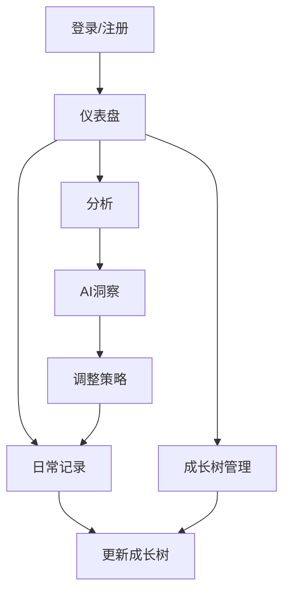

## 1. 产品概述
GrowthOS是一个通过「成长树 + 行为数据 + AI分析」来结构化还原个人完整成长轨迹的系统。
- 解决当前工具无法理解用户成长、缺乏结构和长期分析的问题，目标用户为希望自我成长和自我认知的个人。
- 产品价值在于将个人成长数据化、结构化，并通过AI分析提供个性化的成长建议，最终形成数字化自我模型。

## 2. 核心功能

### 2.1 用户角色
| 角色 | 注册方式 | 核心权限 |
|------|---------------------|------------------|
| 普通用户 | 邮箱注册 | 创建成长树、记录日常活动、查看AI分析 |

### 2.2 功能模块
1. **仪表盘**：成长树预览、日常记录输入、快速统计
2. **成长树**：树结构管理、节点详情、进度追踪
3. **分析**：AI分析结果、行为模式、性格洞察

### 2.3 页面详情
| 页面名称 | 模块名称 | 功能描述 |
|-----------|-------------|---------------------|
| 仪表盘 | 成长树预览 | 成长树的可视化展示，包含主要节点和进度 |
| 仪表盘 | 日常记录 | 日常活动、学习、情绪和反思的输入表单 |
| 仪表盘 | 快速统计 | 近期活动和成长进度的摘要 |
| 成长树 | 树管理 | 跨多个维度添加、编辑、删除节点 |
| 成长树 | 节点详情 | 查看和更新节点属性（掌握度、状态、时间线） |
| 成长树 | 时间线视图 | 跟踪每个节点随时间的进度 |
| 分析 | 行为模式 | AI识别的用户行为模式 |
| 分析 | 性格洞察 | 性格和价值观随时间的变化 |
| 分析 | 成长报告 | 每周和每月的成长总结 |

## 3. 核心流程
### 用户流程
1. 用户注册并登录GrowthOS
2. 用户创建初始成长树，包含不同维度的主要节点
3. 用户记录日常活动、学习、情绪和反思
4. 系统根据记录的活动更新成长树
5. 用户查看AI生成的分析和洞察
6. 用户根据AI建议调整成长策略

## 4. 用户界面设计
### 4.1 设计风格
- 主色调：#4CAF50（绿色）、#2196F3（蓝色）
- 辅助色：#FFC107（黄色）、#9C27B0（紫色）
- 按钮风格：圆角、微妙阴影、悬停效果
- 字体：Inter、system-ui、sans-serif
- 字体大小：16px（正文）、24px（标题）、14px（小文本）
- 布局风格：卡片式布局，充足的留白，顶部导航
- 图标/表情风格：现代、简约，带有自然灵感元素（树、叶子）

### 4.2 页面设计概览
| 页面名称 | 模块名称 | UI元素 |
|-----------|-------------|-------------|
| 仪表盘 | 成长树预览 | 交互式树可视化，带有可展开节点，按进度颜色编码，动画生长效果 |
| 仪表盘 | 日常记录 | 极简表单，快速输入字段，情绪选择下拉菜单，简洁的字符限制 |
| 仪表盘 | 快速统计 | 圆形进度指示器，小型条形图，趋势线 |
| 成长树 | 树管理 | 拖放界面，节点编辑模态框，视觉层次指示器 |
| 成长树 | 节点详情 | 带有进度条的卡片，状态徽章，时间线可视化 |
| 分析 | 行为模式 | 热图，折线图，模式识别高亮 |
| 分析 | 性格洞察 | 性格维度的雷达图，价值观的趋势线 |
| 分析 | 成长报告 | 卡片式布局，关键指标，AI生成的洞察在高亮框中 |

### 4.3 响应式设计
- 桌面优先设计，支持移动设备自适应布局
- 移动设备的触摸优化
- 小屏幕的可折叠导航
- 响应式图表和树可视化

### 4.4 3D场景指导（可选）
- 如果实现3D成长树可视化：
  - 环境：柔和的自然光线，微妙的背景
  -  lighting：温暖的环境光，活动节点的定向高光
  - 相机：树探索的轨道控制
  - 构图：居中的树，留有扩展空间
  - 交互：悬停效果，点击展开节点
  - 后处理：微妙的景深，聚焦于选定节点
