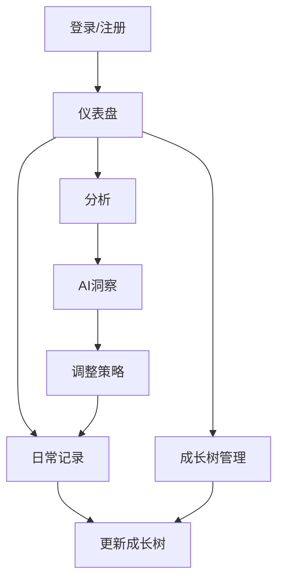

## 1. 产品概述
GrowthOS是一个通过「成长树 + 行为数据 + AI分析」来结构化还原个人完整成长轨迹的系统。
- 解决当前工具无法理解用户成长、缺乏结构和长期分析的问题，目标用户为希望自我成长和自我认知的个人。
- 产品价值在于将个人成长数据化、结构化，并通过AI分析提供个性化的成长建议，最终形成数字化自我模型。

## 2. 核心功能

### 2.1 用户角色
| 角色 | 注册方式 | 核心权限 |
|------|---------------------|------------------|
| 普通用户 | 邮箱注册 | 创建成长树、记录日常活动、查看AI分析 |

### 2.2 功能模块
1. **仪表盘**：成长树预览、日常记录输入、快速统计
2. **成长树**：树结构管理、节点详情、进度追踪、AI园丁模式
3. **分析**：数据统计、AI分析（三层级功能）

### 2.3 页面详情
| 页面名称 | 模块名称 | 功能描述 |
|-----------|-------------|---------------------|
| 仪表盘 | 成长树预览 | 成长树的可视化展示，包含主要节点和进度，空状态显示引导提示 |
| 仪表盘 | 日常记录 | 日常活动、学习、情绪和反思的输入表单，支持标签系统（如 #技能 或 @习惯） |
| 仪表盘 | 快速统计 | 近期活动和成长进度的摘要 |
| 成长树 | 树管理 | 跨多个维度添加、编辑、删除节点 |
| 成长树 | 节点详情 | 查看和更新节点属性（掌握度、状态、时间线） |
| 成长树 | 时间线视图 | 跟踪每个节点随时间的进度 |
| 成长树 | AI园丁模式 | 语义聚类、自动归类、智能层级管理 |
| 分析 | 数据统计 | MVP阶段：展示基础数据统计（如打卡次数、专注时长） |
| 分析 | AI分析-层级一（数据清洗与结构化） | 自动标签化、情绪打分、关联节点，后台默默工作 |
| 分析 | AI分析-层级二（洞察与发现） | 归因分析、隐性模式识别、性格/价值观动态画像 |
| 分析 | AI分析-层级三（行动建议） | 动态策略调整、成长树养护建议 |
| 分析 | 成长报告 | 每周和每月的成长总结，AI分析非实时，每日凌晨生成 |

## 3. 核心流程
### 用户流程
1. 用户注册并登录GrowthOS
2. 用户创建初始成长树，包含不同维度的主要节点
3. 用户记录日常活动、学习、情绪和反思，可添加标签（如 #技能 或 @习惯）
4. 系统通过标签系统和关键词分析自动将记录关联到对应树节点
5. 系统根据关联记录更新成长树节点的掌握度和状态
6. 用户查看数据统计和AI生成的分析（当数据量足够时）
7. 用户根据分析结果调整成长策略

### 数据流动机制
- **标签系统**：用户在记录日常活动时，可使用 #技能、@习惯 等标签，系统根据标签自动关联到对应树节点
- **关键词分析**：系统会分析记录内容中的关键词，如"Python"、"阅读"等，自动映射到相应的树节点
- **自动发芽机制**：当系统检测到日记中有高频关键词（如 #Python），但树中无对应节点时，自动在"未分类"分支下创建一个"Python"影子节点
- **实时与异步处理**：实时（前端）：简单的关键词匹配（正则表达式）匹配 #标签；异步（后台）：AI 的深度分析（情绪、归因、周报）
- **自动更新**：系统根据关联记录的频率和深度，自动更新树节点的掌握度（0-100）和状态（未开始/进行中/深入）

### 2.4 核心业务逻辑
#### 节点层级与自动归类策略
- **默认主干**：系统预置"技能、认知、习惯、生活"四大主干，作为新节点的默认容器
- **智能推荐归类**：
  - 当用户创建新节点（如 #Python）时，AI 分析其语义
  - 若判定属于"编程"，自动将其挂载到"技能树"下，或提示用户"是否归入技能树？"
- **自动聚类（批量整理）**：
  - 系统定期（如每周）扫描"未分类"或"扁平化"的节点
  - 若发现多个节点属于同一语义簇（如 React, Vue, CSS），触发"创建子分类"建议
- **未分类节点管理**：
  - **枯萎/腐烂机制**：未分类的影子节点如果 7 天内未被用户确认，会变灰、枯萎，最终被自动折叠/归档到历史记录
  - **数量限制**："未分类"文件夹最多只显示 5 个节点，超出则显示"..."，提示用户整理

#### AI 园丁模式
- **语义聚类**：AI 分析用户生成的节点，识别语义相似的节点并进行聚类
- **系统预设骨架（MVP 阶段）**：
  - 技能树（硬技能：编程、写作、外语...）
  - 认知树（输入：阅读、课程、观影...）
  - 习惯树（日常：运动、早起、冥想...）
  - 生活树（情感：家庭、社交、旅行...）
- **AI 动态生成子分类（进阶阶段）**：
  - 当某个主干下的节点太多时，AI 建议"拆分"并创建子分类
  - 例如：在"技能树"下创建"设计能力"子分类，包含"设计"、"插画"、"Figma"等节点
- **高光时刻**：当系统检测到用户有多个相关节点时，主动提示用户创建分类并归纳节点

#### 双重反馈机制
- **即时反馈（前端模拟）**：用户写完记录后，界面立即播放"+1 经验值"动画，树稍微抖动，提供即时视觉反馈
- **延时惊喜（后台真实）**：后台 AI 处理完成后，第二天用户打开 App 会看到树的实际生长效果和 AI 分析结果

#### AI 策略（混合模式）
- **标签提取**：使用规则引擎（正则表达式）进行简单的关键词匹配和标签提取
- **情绪打分**：使用 AI 模型（如 Qwen-Turbo）进行情绪分析，确保情绪识别的准确性
- **深度分析**：当数据量达到阈值时，使用 AI 进行深度分析和洞察

## 4. 用户界面设计
### 4.1 设计风格
- 主色调：#4CAF50（绿色）、#2196F3（蓝色）
- 辅助色：#FFC107（黄色）、#9C27B0（紫色）
- 按钮风格：圆角、微妙阴影、悬停效果
- 字体：Inter、system-ui、sans-serif
- 字体大小：16px（正文）、24px（标题）、14px（小文本）
- 布局风格：卡片式布局，充足的留白，顶部导航
- 图标/表情风格：现代、简约，带有自然灵感元素（树、叶子）

### 4.2 页面设计概览
| 页面名称 | 模块名称 | UI元素 |
|-----------|-------------|-------------|
| 仪表盘 | 成长树预览 | 交互式树可视化，带有可展开节点，按进度颜色编码，动画生长效果 |
| 仪表盘 | 日常记录 | 极简表单，快速输入字段，情绪选择下拉菜单，简洁的字符限制 |
| 仪表盘 | 快速统计 | 圆形进度指示器，小型条形图，趋势线 |
| 成长树 | 树管理 | 拖放界面，节点编辑模态框，视觉层次指示器 |
| 成长树 | 节点详情 | 带有进度条的卡片，状态徽章，时间线可视化 |
| 分析 | 行为模式 | 热图，折线图，模式识别高亮 |
| 分析 | 性格洞察 | 性格维度的雷达图，价值观的趋势线 |
| 分析 | 成长报告 | 卡片式布局，关键指标，AI生成的洞察在高亮框中 |

### 4.3 响应式设计
- 桌面优先设计，支持移动设备自适应布局
- 移动设备的触摸优化
- 小屏幕的可折叠导航
- 响应式图表和树可视化

### 4.4 空状态与异常状态设计
- **空状态**：
  - 新用户：显示引导页面，提示用户创建第一个成长树节点
  - 无记录：显示"开始记录你的成长之旅"的鼓励信息
  - 无分析数据：显示"积累更多数据以获得深度分析"的提示
- **异常状态**：
  - 断更提醒：如果用户超过3天未记录，显示温和的提醒
  - 树枯萎效果：如果用户超过7天未记录，成长树会显示枯萎状态，重新记录后会逐渐恢复生机
  - 网络错误：显示友好的错误提示，引导用户检查网络连接

### 4.5 AI分析功能详细描述
#### 层级一：数据清洗与结构化
- **功能点**：
  - 自动标签化：用户写"今天学了 React hooks，有点难懂"，系统自动打上 #技能学习、#前端、#困难 标签
  - 情绪打分：AI 分析文本情感，给出一个 -10 到 +10 的情绪分值
  - 关联节点：系统判断这段话应该归属于成长树上的哪个节点（例如自动关联到"React 技能树"）
- **PRD 描述**：
  - 输入：用户每日记录的文本
  - 处理：
    - 实时（前端）：使用正则表达式进行简单的关键词匹配和标签提取
    - 异步（后台）：当数据量达到阈值时，调用 LLM 进行深度分析
  - 输出：结构化的 JSON 数据（用于更新树节点进度和情绪曲线）
- **MVP 降级**：MVP 阶段，仅使用规则引擎（关键词匹配）实现自动标签和关联节点，AI 深度分析仅用于周报总结

#### 层级二：洞察与发现（用户看得见的价值）
- **功能点**：
  - 归因分析：当用户效率很低时，AI 输出"检测到当你前一天睡眠不足（<6h）且摄入咖啡因时，今日专注度平均下降 40%"
  - 隐性模式识别：当用户觉得自己总是半途而废时，AI 输出"分析显示，你的'放弃'通常发生在项目开始后的第 3 周（热情消退期），建议此时设置强制提醒"
  - 性格/价值观动态画像：基于行为推断，AI 输出"本月你 80% 的记录都与'帮助他人'有关，你的核心价值观正从'成就导向'向'利他导向'偏移"
- **处理方式**：异步处理，AI 分析任务在后台执行，用户写完日记后，分析结果可能在 5-10 分钟后才更新在仪表盘上
- **MVP 降级**：MVP 阶段，仅在用户数据量超过 10 条时，每周生成一次洞察报告

#### 层级三：行动建议（闭环）
- **功能点**：
  - 动态策略调整：AI 建议"你本周'深度学习'节点的进度滞后，但'会议'记录过多。建议下周开启'勿扰模式'，每天预留 2 小时深度工作"
  - 成长树养护建议：AI 建议"你的'编程'技能树已经很久没生长了，要不要回顾一下上个月的笔记？"
- **处理方式**：异步处理，与层级二的洞察分析一起生成
- **MVP 降级**：MVP 阶段，行动建议基于简单的规则引擎生成，如"连续 3 天未记录，建议恢复记录"

### 4.6 可视化设计优先级
- **优先级**：数据准确性 > 2D 交互 > 3D 特效（V2 版本再做）
- **MVP 可视化**：使用 2.5D 等轴侧图或 SVG 矢量图
- **动画效果**：使用 CSS 做简单的"长高"、"变色"动画，避免使用 WebGL
- **V2 计划**：3D 成长树可视化（Three.js）将在 V2 版本中实现
