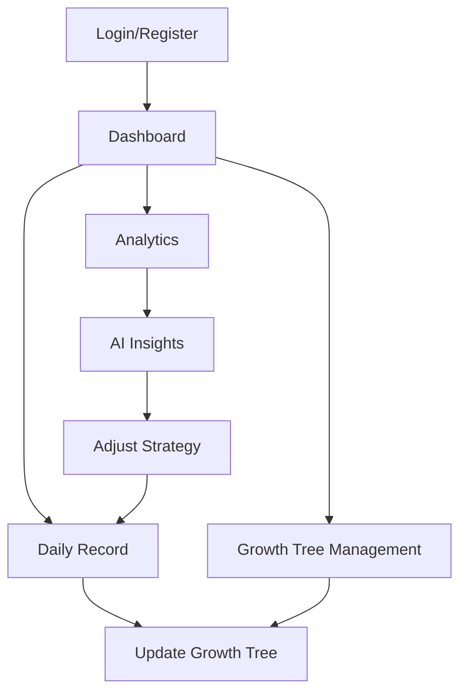

## 1. Product Overview
GrowthOS是一个通过「成长树 + 行为数据 + AI分析」来结构化还原个人完整成长轨迹的系统。
- 解决当前工具无法理解用户成长、缺乏结构和长期分析的问题，目标用户为希望自我成长和自我认知的个人。
- 产品价值在于将个人成长数据化、结构化，并通过AI分析提供个性化的成长建议，最终形成数字化自我模型。

## 2. Core Features

### 2.1 User Roles
| Role | Registration Method | Core Permissions |
|------|---------------------|------------------|
| Normal User | Email registration | Create growth tree, record daily activities, view AI analysis |

### 2.2 Feature Module
1. **Dashboard**: Growth tree visualization, daily record input, quick stats
2. **Growth Tree**: Tree structure management, node details, progress tracking
3. **Analytics**: AI analysis results, behavior patterns, personality insights

### 2.3 Page Details
| Page Name | Module Name | Feature description |
|-----------|-------------|---------------------|
| Dashboard | Growth Tree Preview | Visual representation of growth tree with main nodes and progress |
| Dashboard | Daily Record | Input form for daily activities, learning, mood, and reflection |
| Dashboard | Quick Stats | Summary of recent activities and growth progress |
| Growth Tree | Tree Management | Add, edit, delete nodes across multiple dimensions |
| Growth Tree | Node Details | View and update node properties (mastery, status, timeline) |
| Growth Tree | Timeline View | Track progress over time for each node |
| Analytics | Behavior Patterns | AI-identified patterns in user behavior |
| Analytics | Personality Insights | Changes in personality and values over time |
| Analytics | Growth Report | Weekly and monthly summaries of growth |

## 3. Core Process
### User Flow
1. User registers and logs in to GrowthOS
2. User creates initial growth tree with main nodes across different dimensions
3. User records daily activities, learning, mood, and reflections
4. System updates growth tree based on recorded activities
5. User views analytics and insights generated by AI
6. User adjusts growth strategy based on AI recommendations

## 4. User Interface Design
### 4.1 Design Style
- Primary colors: #4CAF50 (green), #2196F3 (blue)
- Secondary colors: #FFC107 (yellow), #9C27B0 (purple)
- Button style: Rounded corners, subtle shadows, hover effects
- Font: Inter, system-ui, sans-serif
- Font sizes: 16px (body), 24px (headings), 14px (small text)
- Layout style: Card-based with ample white space, top navigation
- Icon/emoji style: Modern, minimal, with nature-inspired elements (trees, leaves)

### 4.2 Page Design Overview
| Page Name | Module Name | UI Elements |
|-----------|-------------|-------------|
| Dashboard | Growth Tree Preview | Interactive tree visualization with expandable nodes, color-coded by progress, animated growth effects |
| Dashboard | Daily Record | Minimalist form with quick input fields, dropdowns for mood selection, character limits for brevity |
| Dashboard | Quick Stats | Circular progress indicators, small bar charts, trend lines |
| Growth Tree | Tree Management | Drag-and-drop interface, node editing modal, visual hierarchy indicators |
| Growth Tree | Node Details | Card with progress bar, status badges, timeline visualization |
| Analytics | Behavior Patterns | Heat maps, line charts, pattern recognition highlights |
| Analytics | Personality Insights | Radar charts for personality dimensions, trend lines for values |
| Analytics | Growth Report | Card-based layout with key metrics, AI-generated insights in highlighted boxes |

### 4.3 Responsiveness
- Desktop-first design with mobile-adaptive layout
- Touch optimization for mobile devices
- Collapsible navigation for smaller screens
- Responsive chart and tree visualizations

### 4.4 3D Scene Guidance (Optional)
- If implementing 3D growth tree visualization:
  - Environment: Soft, natural lighting with subtle background
  - Lighting: Warm ambient light with directional highlights on active nodes
  - Camera: Orbit controls for tree exploration
  - Composition: Centered tree with space for expansion
  - Interactions: Hover effects, click-to-expand nodes
  - Post-processing: Subtle depth of field for focus on selected nodes
## 1. Product Overview
## 1. Product Overview
GrowthOS是一个通过「成长树 + 行为数据 + AI分析」来结构化还原个人## 1. Product Overview
GrowthOS是一个通过「成长树 + 行为数据 + AI分析」来结构化还原个人完整成长轨迹的系统。
- 解决当前工具无法理解用户成长、缺乏结构## 1. Product Overview
GrowthOS是一个通过「成长树 + 行为数据 + AI分析」来结构化还原个人完整成长轨迹的系统。
- 解决当前工具无法理解用户成长、缺乏结构和长期分析的问题，目标用户为希望## 1. Product Overview
GrowthOS是一个通过「成长树 + 行为数据 + AI分析」来结构化还原个人完整成长轨迹的系统。
- 解决当前工具无法理解用户成长、缺乏结构和长期分析的问题，目标用户为希望自我成长和自我认知的个人。
## 1. Product Overview
GrowthOS是一个通过「成长树 + 行为数据 + AI分析」来结构化还原个人完整成长轨迹的系统。
- 解决当前工具无法理解用户成长、缺乏结构和长期分析的问题，目标用户为希望自我成长和自我认知的个人。
- 产品价值在于将个人成长数据化、结构化，并通过AI分析提供个性化的成长## 1. Product Overview
GrowthOS是一个通过「成长树 + 行为数据 + AI分析」来结构化还原个人完整成长轨迹的系统。
- 解决当前工具无法理解用户成长、缺乏结构和长期分析的问题，目标用户为希望自我成长和自我认知的个人。
- 产品价值在于将个人成长数据化、结构化，并通过AI分析提供个性化的成长建议，最终形成数字化自我模型。

## 2. Core Features

##### 1. Product Overview
GrowthOS是一个通过「成长树 + 行为数据 + AI分析」来结构化还原个人完整成长轨迹的系统。
- 解决当前工具无法理解用户成长、缺乏结构和长期分析的问题，目标用户为希望自我成长和自我认知的个人。
- 产品价值在于将个人成长数据化、结构化，并通过AI分析提供个性化的成长建议，最终形成数字化自我模型。

## 2. Core Features

### 2.1 User Roles
| Role | Registration Method | Core Permissions |
|## 1. Product Overview
GrowthOS是一个通过「成长树 + 行为数据 + AI分析」来结构化还原个人完整成长轨迹的系统。
- 解决当前工具无法理解用户成长、缺乏结构和长期分析的问题，目标用户为希望自我成长和自我认知的个人。
- 产品价值在于将个人成长数据化、结构化，并通过AI分析提供个性化的成长建议，最终形成数字化自我模型。

## 2. Core Features

### 2.1 User Roles
| Role | Registration Method | Core Permissions |
|------|---------------------|------------------|
| Normal User | Email registration | Create growth tree,