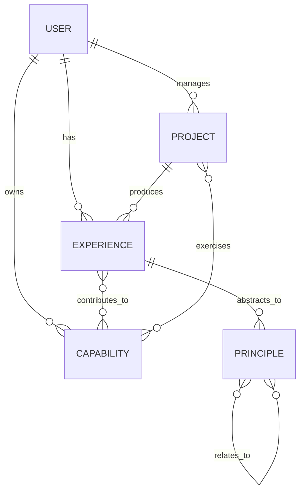

# GrowthOS 产品需求文档 (PRD)

## 0. 产品哲学

> **AI时代知识越来越便宜，经验越来越值钱。**

### 0.1 我们要解决的真问题

大多数人每天都在用各种工具**记录**，但很少有人真正在**成长**。

```
记录（Record）     →  经验（Experience）  →  能力（Capability）  →  人生（Life）
    │                       │                       │                   │
    事实存档              反思+抽象                可迁移的技能           长期战略
    容易                 困难                     长期积累              极少人做到
```

主流笔记软件（Notion、Obsidian、Logseq）解决了"记录"和"知识管理"，但**没有人系统地帮助用户把经历变成经验、把经验变成能力、把能力汇聚成人生战略**。

### 0.2 产品定位

**GrowthOS = 个人经验管理系统（Personal Experience Management System）**

不是另一个笔记软件，不是一个 Todo 工具，也不是一个"AI 聊天机器人"。

而是一个帮助用户回答核心问题的系统：

> **"你正在成为谁？"**

### 0.3 核心闭环

```
经历 (Experience)
   ↓
反思 (Reflection)
   ↓
抽象 (Abstraction)
   ↓
形成经验 (Principle)
   ↓
迁移到新场景 (Transfer)
   ↓
能力提升 (Capability Growth)
   ↓
（回到新的经历）
```

---

## 1. 产品概述

GrowthOS 是一款**个人经验管理系统**，通过「能力树 + 经验网络 + 成长画像」帮助用户把日常经历提炼为可迁移的能力，最终形成清晰的自我认知与长期战略。

- **目标用户**：希望系统性自我成长、需要长期自我认知、希望把经历变成能力的人
- **核心价值**：把零散的"经历"提炼为"经验"，把"经验"沉淀为"能力"，把"能力"汇聚为"人生操作系统"
- **差异化**：相比 Notion/Obsidian 等知识管理工具，GrowthOS 关注的是"活的能力成长"而非"死的知识存储"

### 1.1 三大核心实体

| 实体                  | 含义                                   | 解决什么问题                 |
| --------------------- | -------------------------------------- | ---------------------------- |
| **经历 (Experience)** | 真实发生过的事件 + 反思 + 抽象出的原则 | 把"流水账"变成"可复用的经验" |
| **能力 (Capability)** | 可迁移、可测量、可成长的核心能力       | 回答"我比三个月前强在哪里"   |
| **项目 (Project)**    | 当前在做的事，是能力成长的载体         | 把成长"具象化"，避免空谈     |

### 1.2 AI 角色：成长教练 (Growth Coach)

AI 不是聊天对象，而是用户的**私人成长教练**，持续完成四件事：

1. **分析** — 识别用户行为背后的能力变化
2. **诊断** — 指出能力停滞、目标失效、经验断层的信号
3. **建议** — 推荐下一步该做什么、学什么、迁移什么
4. **复盘** — 定期生成成长报告，追踪长期趋势

---

## 2. 核心功能模块

### 2.1 用户旅程：从"记录者"到"成长者"

| 阶段 | 用户行为             | 系统能力                                    |
| ---- | -------------------- | ------------------------------------------- |
| 入门 | 写下第一个经历       | 自动识别能力点，初始化能力画像              |
| 养成 | 持续记录、反思、抽象 | 自动归类、聚类、能力图谱更新                |
| 沉淀 | 经验形成原则         | 经验网络可视化，原则可检索                  |
| 跃迁 | 能力迁移到新场景     | AI 推荐"基于你的经验，这类问题建议这样处理" |
| 长期 | 形成自我认知         | 成长画像 + 长期战略建议                     |

### 2.2 五大功能模块

#### 模块一：经历记录 (Experience Capture)

**不是简单的"日记"，而是结构化的反思模板。**

每次记录强制要求三个层次：

```yaml
event: # 客观事件（发生了什么）
  - '参加了数学竞赛'
  - '结果排名 50/200'

reflection: # 主观反思（我学到了什么）
  - '复习范围太窄'
  - '押题策略失败'

principle: # 抽象原则（下次怎么做）
  - '不要押题，要扎实基础'
  - '重要比赛前 1 个月开始强化训练'

confidence: # 对原则的确信度（0-1）
  - 0.8
```

**目标**：让用户从"流水账"升级为"经验生产者"。

#### 模块二：能力画像 (Capability Profile)

**回答核心问题："你正在成为谁？"**

能力有四要素：

| 维度         | 含义               | 示例                             |
| ------------ | ------------------ | -------------------------------- |
| **名称**     | 能力的具体名称     | 战略思维、写作能力、英语口语     |
| **类别**     | 能力的分类         | 思维 / 技能 / 认知 / 体能 / 社交 |
| **当前水平** | 0-100 的量化评分   | 65 / 100                         |
| **成长曲线** | 随时间的变化       | 三个月内 +12                     |
| **目标水平** | 用户期望达到的水平 | 80 / 100                         |

**能力树结构**（预设骨架 + 用户自定义）：

```
战略思维
├─ 系统思维
├─ 博弈论
├─ 第一性原理
└─ 产业分析

英语能力
├─ 词汇
├─ 阅读
├─ 写作
└─ 听力
```

**核心机制**：每条经历可以**贡献**到多个能力，每次贡献带权重。

#### 模块三：经验网络 (Experience Network)

**经历之间不是孤立的，而是有联系的。**

比如：

- "数学竞赛失败" + "英语演讲获奖" → 都能贡献到"长期坚持能力"
- "Flutter项目完成" + "读了《架构整洁之道》" → 都能贡献到"系统设计能力"

**经验网络**是一张图：

- 节点 = 经历 / 原则
- 边 = 相似性、迁移路径、贡献关系

**AI 工作**：自动识别相似经验、推荐"迁移场景"。

#### 模块四：项目复盘 (Project Retrospective)

**成长不发生在"学习"中，发生在"做事"中。**

每个项目包含：

```yaml
project:
  name: 'Flutter 重构 XXX'
  start_date: '2024-01-01'
  end_date: '2024-03-01'
  status: completed | active | paused | abandoned

capabilities_used: # 涉及的能力
  - 系统设计
  - 状态管理
  - 性能优化

experience_gained: # 提炼的经验
  - 经验 1
  - 经验 2

retrospective: # 复盘
  what_went_well: [...]
  what_went_wrong: [...]
  next_time: [...]
```

#### 模块五：成长画像 (Growth Portrait)

**首页不再是"今日待办"，而是"你正在成为谁"。**

包含：

1. **能力雷达图** — 当前能力 vs 目标能力
2. **成长曲线** — 过去 3/6/12 个月的能力变化
3. **核心经验库** — 你提炼的最重要的 10 条原则
4. **AI 周报 / 月报** — 自动生成的成长总结
5. **推荐下一步** — 基于当前状态的"下一步该做什么"

---

## 3. 数据模型（核心实体）

### 3.1 实体关系图


```mermaid
erDiagram
    USER ||--o{ EXPERIENCE : has
    USER ||--o{ CAPABILITY : owns
    USER ||--o{ PROJECT : manages
    EXPERIENCE }o--o{ CAPABILITY : contributes_to
    PROJECT }o--o{ CAPABILITY : exercises
    PROJECT ||--o{ EXPERIENCE : produces
    EXPERIENCE ||--o{ PRINCIPLE : abstracts_to
    PRINCIPLE }o--o{ PRINCIPLE : relates_to
```

### 3.2 核心表结构

#### experiences（经历）

| 字段        | 类型      | 说明             |
| ----------- | --------- | ---------------- |
| id          | TEXT PK   |                  |
| user_id     | TEXT FK   |                  |
| event       | TEXT      | 客观事件         |
| reflection  | TEXT      | 主观反思         |
| principle   | TEXT      | 抽象原则         |
| confidence  | REAL      | 确信度 0-1       |
| project_id  | TEXT FK   | 关联项目（可选） |
| occurred_at | TIMESTAMP | 事件发生时间     |
| created_at  | TIMESTAMP |                  |
| updated_at  | TIMESTAMP |                  |

#### capabilities（能力）

| 字段          | 类型      | 说明                     |
| ------------- | --------- | ------------------------ |
| id            | TEXT PK   |                          |
| user_id       | TEXT FK   |                          |
| name          | TEXT      | 能力名称                 |
| category      | TEXT      | 思维/技能/认知/体能/社交 |
| parent_id     | TEXT FK   | 父能力（支持树形）       |
| current_level | REAL      | 当前水平 0-100           |
| target_level  | REAL      | 目标水平                 |
| growth_rate   | REAL      | 增长率（系统计算）       |
| last_updated  | TIMESTAMP |                          |

#### experience_capability_links（经历-能力关联）

| 字段          | 类型    | 说明            |
| ------------- | ------- | --------------- |
| experience_id | TEXT FK |                 |
| capability_id | TEXT FK |                 |
| contribution  | REAL    | 贡献度 0-1      |
| evidence      | TEXT    | 证据（AI 提取） |

#### principles（原则）

| 字段               | 类型    | 说明             |
| ------------------ | ------- | ---------------- |
| id                 | TEXT PK |                  |
| user_id            | TEXT FK |                  |
| content            | TEXT    | 原则内容         |
| source_experiences | TEXT    | 来源经历 ID 列表 |
| category           | TEXT    | 分类             |
| confidence         | REAL    | 确信度           |

#### projects（项目）

| 字段          | 类型    | 说明                              |
| ------------- | ------- | --------------------------------- |
| id            | TEXT PK |                                   |
| user_id       | TEXT FK |                                   |
| name          | TEXT    |                                   |
| description   | TEXT    |                                   |
| status        | TEXT    | active/completed/paused/abandoned |
| start_date    | DATE    |                                   |
| end_date      | DATE    |                                   |
| retrospective | TEXT    | 复盘                              |

### 3.3 保留兼容：传统记录表

为降低迁移成本，旧 records 表保留，但作为"原始素材"存在：

```
records（原始记录）→ 经过反思 → experiences（经验）
```

**演进路径**：

- V1（现在）：records 直接存到 experiences（结构化模板）
- V2：records 作为草稿，AI 辅助升级为 experience
- V3：用户只写"经历"草稿，AI 主动提示补全 reflection 和 principle

---

## 4. AI 成长教练（Growth Coach）

### 4.1 四大职责

| 职责     | 输入               | 输出                        | 触发时机            |
| -------- | ------------------ | --------------------------- | ------------------- |
| **分析** | 经历文本           | 能力点提取、贡献度评估      | 写入经历时（实时）  |
| **诊断** | 能力曲线、项目状态 | "你的 X 能力已 60 天未更新" | 每日凌晨            |
| **建议** | 当前状态 + 历史    | "下一步该做 X"              | 用户主动询问 / 周报 |
| **复盘** | 一段时间内所有经历 | 成长报告、能力变化总结      | 每周/每月           |

### 4.2 MVP 降级策略

**V1 阶段（无 AI / 规则引擎）**：

- 用户手动选择"这次经历涉及哪些能力"
- 用户手动填写"原则"和"自信度"
- 系统基于规则生成简单报告（"本月你 80% 经历都贡献给了 X 能力"）

**V2 阶段（轻量 AI）**：

- 接入 LLM，自动从经历中提取"反思"和"原则"（用户可编辑）
- 自动推荐可能涉及的能力（用户确认）
- 自动生成周报

**V3 阶段（深度 AI）**：

- 主动学习用户的能力评估习惯
- 主动推送"你的 X 经验可以迁移到 Y 场景"
- 长期成长预测

### 4.3 隐私与本地优先

**核心原则**：所有 AI 分析优先在本地完成，必须使用云端 LLM 时：

- 明确告知用户哪些数据被发送
- 提供"完全离线模式"开关
- 用户可随时清除 AI 历史

---

## 5. 用户体验设计

### 5.1 首页哲学：从"今日待办"到"你正在成为谁"

**旧首页**：

```
- 今日待办 3 项
- 最近 5 条记录
- 本周统计
```

**新首页**：

```
┌──────────────────────────────────────┐
│  👤 你正在成为谁？                       │
│                                       │
│  📊 能力雷达图                          │
│  - 战略思维: 65 → 78  (+13 本季度)    │
│  - 写作能力: 45 → 52  (+7)            │
│  - 系统设计: 70 → 75  (+5)            │
│                                       │
│  💡 本周核心洞察                        │
│  "本月你 80% 经历都贡献给了系统设计能力，  │
│   战略思维已 45 天未更新"               │
│                                       │
│  📝 快速记录                           │
│  [今天发生了什么？]                    │
│                                       │
│  🎯 推荐下一步                         │
│  - 回顾 1 个月前的 X 经验              │
│  - 完成 Y 项目复盘                     │
│  - 设定 Z 能力本季度目标               │
└──────────────────────────────────────┘
```

### 5.2 关键交互

#### 经历记录：渐进式引导

用户写"今天发生了什么"时，不是直接要求填三个字段，而是：

1. **第一步**：先写"事件"（降低门槛）
2. **第二步**：AI 提示"你从这个事件中学到了什么？"（引导反思）
3. **第三步**：提示"如果用一个原则总结这次经历？"（引导抽象）
4. **可选**：标记自信度、关联项目

#### 能力树：双向操作

- **自上而下**：从能力角度 → 查看"哪些经历贡献给了它"
- **自下而上**：从经历角度 → 看到"这次经历让我哪些能力提升了"

#### 经验网络：可视化迁移

- 点击一条原则 → 看到"这个原则在哪些场景中适用"
- AI 主动推送："你 X 项目的经验可以迁移到当前 Y 场景"

---

## 6. 衡量成功的指标

**核心指标**（相比传统工具）：

| 指标     | 传统工具     | GrowthOS 目标              |
| -------- | ------------ | -------------------------- |
| 用户日活 | 看记录数     | 看"能力提升感知"           |
| 留存     | 7 日 / 30 日 | 90 日 / 180 日             |
| 用户价值 | 数据量       | 提炼的原则数、识别的能力点 |
| NPS      | 通用         | "帮助我看见自己成长"       |

**北极星指标**：**每月用户新增"被 AI 验证有效的原则"数量**。

---

## 7. 路线图

### V1（现在 - 4 周）：能力驱动的 MVP

- 数据模型重构：引入 experiences / capabilities / principles
- 能力树 CRUD（手动管理）
- 经历记录（结构化模板：event / reflection / principle）
- 能力-经历关联
- 基础首页：能力雷达图

### V2（1-2 月）：成长画像

- 成长曲线（能力随时间变化）
- 经验网络可视化
- 项目复盘
- 简单规则引擎报告

### V3（3-4 月）：AI 教练

- LLM 集成（自动提取 reflection / principle）
- 主动诊断（"X 能力已 N 天未更新"）
- 经验迁移推荐

### V4（5-6 月）：跨设备 + 高级 AI

- Capacitor 打包移动 App
- SQLCipher 加密数据库
- 云端备份（可选，端到端加密）
- 长期成长预测

---

## 8. 总结

**GrowthOS 不是另一个笔记软件。**

它的野心是：

- 把"经历"变成"经验"
- 把"经验"变成"能力"
- 把"能力"汇聚成"你的人生操作系统"

最终回答用户一个问题：

> **"你正在成为谁？"**

---

_文档版本：v2.0 - 经验管理系统定位_
_更新时间：2024_
