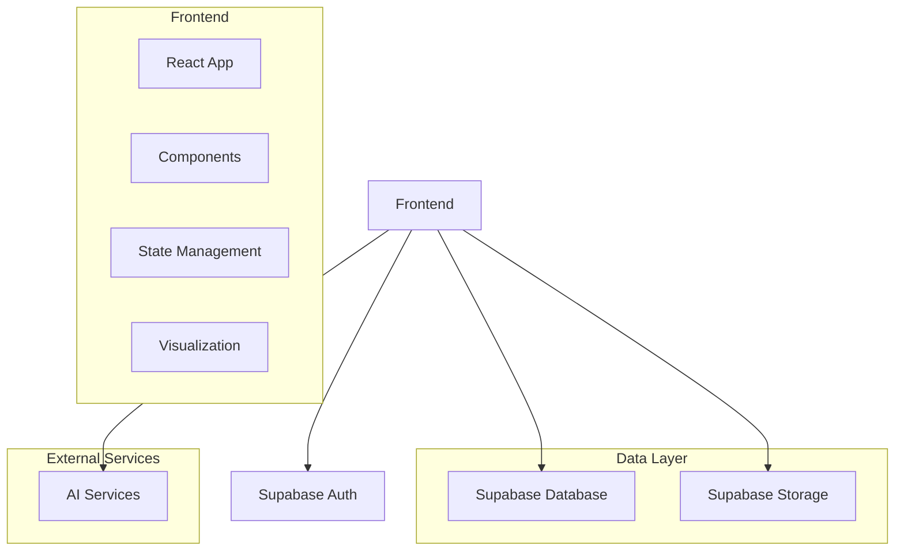

## 1. Architecture Design


## 2. Technology Description
- Frontend: React@18 + Tailwind CSS@3 + Vite
- Initialization Tool: Vite
- Backend: Supabase (for auth, database, and storage)
- Database: Supabase (PostgreSQL)
- UI Libraries: React Flow (for tree visualization), Recharts (for analytics charts)
- Authentication: Supabase Auth
- Storage: Supabase Storage (for user data and media)

## 3. Route Definitions
| Route | Purpose |
|-------|---------|
| / | Dashboard with growth tree preview and daily record |
| /growth-tree | Detailed growth tree management |
| /analytics | AI analysis and insights |
| /auth | Authentication (login/register) |

## 4. API Definitions
### Supabase Client SDK
- Authentication: `supabase.auth.signUp()`, `supabase.auth.signIn()`, `supabase.auth.signOut()`
- Database: `supabase.from('table').select()`, `supabase.from('table').insert()`, `supabase.from('table').update()`, `supabase.from('table').delete()`
- Storage: `supabase.storage.from('bucket').upload()`, `supabase.storage.from('bucket').download()`

## 5. Data Model
### 5.1 Data Model Definition
```mermaid
erDiagram
    USERS ||--o{ GROWTH_TREES : has
    GROWTH_TREES ||--o{ TREE_NODES : contains
    USERS ||--o{ DAILY_RECORDS : creates
    TREE_NODES ||--o{ NODE_RECORDS :关联
    DAILY_RECORDS ||--o{ RECORD_ITEMS :包含
    USERS ||--o{ PERSONALITY_DATA : has
    USERS ||--o{ ANALYTICS_REPORTS : receives

    USERS {
        id UUID PK
        email TEXT UNIQUE
        password TEXT
        name TEXT
        created_at TIMESTAMP
    }

    GROWTH_TREES {
        id UUID PK
        user_id UUID FK
        name TEXT
        created_at TIMESTAMP
    }

    TREE_NODES {
        id UUID PK
        tree_id UUID FK
        parent_id UUID FK
        name TEXT
        type TEXT (knowledge, skill, personality, value, habit, project)
        mastery INTEGER (0-100)
        status TEXT (not_started, in_progress, deep)
        start_date TIMESTAMP
        last_updated TIMESTAMP
    }

    DAILY_RECORDS {
        id UUID PK
        user_id UUID FK
        date DATE
        mood TEXT
        reflection TEXT
        created_at TIMESTAMP
    }

    RECORD_ITEMS {
        id UUID PK
        record_id UUID FK
        type TEXT (activity, learning)
        content TEXT
    }

    NODE_RECORDS {
        id UUID PK
        node_id UUID FK
        record_id UUID FK
        progress_change INTEGER
        created_at TIMESTAMP
    }

    PERSONALITY_DATA {
        id UUID PK
        user_id UUID FK
        dimension TEXT
        value INTEGER (0-100)
        recorded_at TIMESTAMP
    }

    ANALYTICS_REPORTS {
        id UUID PK
        user_id UUID FK
        report_type TEXT (weekly, monthly)
        period TEXT
        content JSONB
        created_at TIMESTAMP
    }
```

### 5.2 Data Definition Language
```sql
-- Create users table
CREATE TABLE users (
  id UUID PRIMARY KEY DEFAULT gen_random_uuid(),
  email TEXT UNIQUE NOT NULL,
  password TEXT NOT NULL,
  name TEXT,
  created_at TIMESTAMP DEFAULT NOW()
);

-- Create growth_trees table
CREATE TABLE growth_trees (
  id UUID PRIMARY KEY DEFAULT gen_random_uuid(),
  user_id UUID REFERENCES users(id),
  name TEXT NOT NULL,
  created_at TIMESTAMP DEFAULT NOW()
);

-- Create tree_nodes table
CREATE TABLE tree_nodes (
  id UUID PRIMARY KEY DEFAULT gen_random_uuid(),
  tree_id UUID REFERENCES growth_trees(id),
  parent_id UUID REFERENCES tree_nodes(id),
  name TEXT NOT NULL,
  type TEXT NOT NULL,
  mastery INTEGER DEFAULT 0,
  status TEXT DEFAULT 'not_started',
  start_date TIMESTAMP,
  last_updated TIMESTAMP DEFAULT NOW()
);

-- Create daily_records table
CREATE TABLE daily_records (
  id UUID PRIMARY KEY DEFAULT gen_random_uuid(),
  user_id UUID REFERENCES users(id),
  date DATE NOT NULL,
  mood TEXT,
  reflection TEXT,
  created_at TIMESTAMP DEFAULT NOW()
);

-- Create record_items table
CREATE TABLE record_items (
  id UUID PRIMARY KEY DEFAULT gen_random_uuid(),
  record_id UUID REFERENCES daily_records(id),
  type TEXT NOT NULL,
  content TEXT NOT NULL
);

-- Create node_records table
CREATE TABLE node_records (
  id UUID PRIMARY KEY DEFAULT gen_random_uuid(),
  node_id UUID REFERENCES tree_nodes(id),
  record_id UUID REFERENCES daily_records(id),
  progress_change INTEGER DEFAULT 0,
  created_at TIMESTAMP DEFAULT NOW()
);

-- Create personality_data table
CREATE TABLE personality_data (
  id UUID PRIMARY KEY DEFAULT gen_random_uuid(),
  user_id UUID REFERENCES users(id),
  dimension TEXT NOT NULL,
  value INTEGER NOT NULL,
  recorded_at TIMESTAMP DEFAULT NOW()
);

-- Create analytics_reports table
CREATE TABLE analytics_reports (
  id UUID PRIMARY KEY DEFAULT gen_random_uuid(),
  user_id UUID REFERENCES users(id),
  report_type TEXT NOT NULL,
  period TEXT NOT NULL,
  content JSONB,
  created_at TIMESTAMP DEFAULT NOW()
);

-- Create indexes
CREATE INDEX idx_tree_nodes_tree_id ON tree_nodes(tree_id);
CREATE INDEX idx_tree_nodes_parent_id ON tree_nodes(parent_id);
CREATE INDEX idx_daily_records_user_id_date ON daily_records(user_id, date);
CREATE INDEX idx_record_items_record_id ON record_items(record_id);
CREATE INDEX idx_node_records_node_id ON node_records(node_id);
CREATE INDEX idx_personality_data_user_id_dimension ON personality_data(user_id, dimension);
CREATE INDEX idx_analytics_reports_user_id_type ON analytics_reports(user_id, report_type);

-- Set up RLS (Row Level Security)
ALTER TABLE users ENABLE ROW LEVEL SECURITY;
ALTER TABLE growth_trees ENABLE ROW LEVEL SECURITY;
ALTER TABLE tree_nodes ENABLE ROW LEVEL SECURITY;
ALTER TABLE daily_records ENABLE ROW LEVEL SECURITY;
ALTER TABLE record_items ENABLE ROW LEVEL SECURITY;
ALTER TABLE node_records ENABLE ROW LEVEL SECURITY;
ALTER TABLE personality_data ENABLE ROW LEVEL SECURITY;
ALTER TABLE analytics_reports ENABLE ROW LEVEL SECURITY;

-- Create policies
CREATE POLICY "Users can view own data" ON users
  FOR SELECT USING (auth.uid() = id);

CREATE POLICY "Users can create own growth trees" ON growth_trees
  FOR INSERT WITH CHECK (auth.uid() = user_id);

CREATE POLICY "Users can view own growth trees" ON growth_trees
  FOR SELECT USING (auth.uid() = user_id);

CREATE POLICY "Users can update own growth trees" ON growth_trees
  FOR UPDATE USING (auth.uid() = user_id);

CREATE POLICY "Users can delete own growth trees" ON growth_trees
  FOR DELETE USING (auth.uid() = user_id);

-- Similar policies for other tables...
