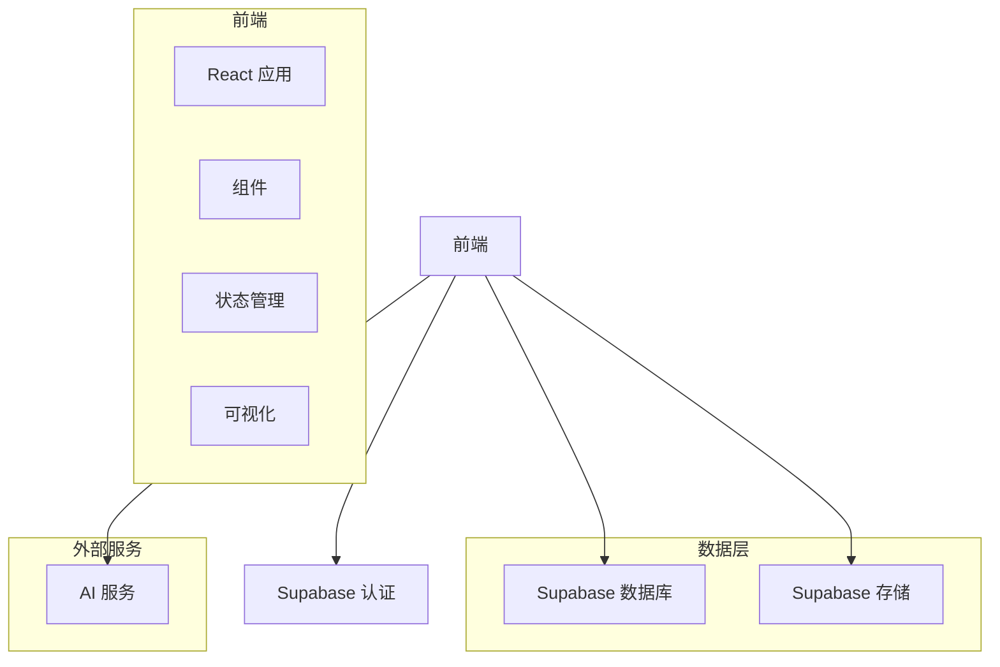

## 1. 架构设计


## 2. 技术描述
- 前端：React@18 + Tailwind CSS@3 + Vite
- 初始化工具：Vite
- 后端：Supabase（用于认证、数据库和存储）
- 数据库：Supabase（PostgreSQL）
- UI 库：React Flow（用于树可视化）、Recharts（用于分析图表）
- 认证：Supabase Auth
- 存储：Supabase Storage（用于用户数据和媒体）

## 3. 路由定义
| 路由 | 用途 |
|-------|---------|
| / | 仪表盘，包含成长树预览和日常记录 |
| /growth-tree | 详细的成长树管理 |
| /analytics | AI 分析和洞察 |
| /auth | 认证（登录/注册） |

## 4. API 定义
### Supabase 客户端 SDK
- 认证：`supabase.auth.signUp()`、`supabase.auth.signIn()`、`supabase.auth.signOut()`
- 数据库：`supabase.from('table').select()`、`supabase.from('table').insert()`、`supabase.from('table').update()`、`supabase.from('table').delete()`
- 存储：`supabase.storage.from('bucket').upload()`、`supabase.storage.from('bucket').download()`

## 5. 数据模型
### 5.1 数据模型定义
```mermaid
erDiagram
    USERS ||--o{ GROWTH_TREES : 拥有
    GROWTH_TREES ||--o{ TREE_NODES : 包含
    USERS ||--o{ DAILY_RECORDS : 创建
    TREE_NODES ||--o{ NODE_RECORDS : 关联
    DAILY_RECORDS ||--o{ RECORD_ITEMS : 包含
    USERS ||--o{ PERSONALITY_DATA : 拥有
    USERS ||--o{ ANALYTICS_REPORTS : 接收

    USERS {
        id UUID PK
        email TEXT UNIQUE
        password TEXT
        name TEXT
        created_at TIMESTAMP
    }

    GROWTH_TREES {
        id UUID PK
        user_id UUID FK
        name TEXT
        created_at TIMESTAMP
    }

    TREE_NODES {
        id UUID PK
        tree_id UUID FK
        parent_id UUID FK
        name TEXT
        type TEXT (knowledge, skill, personality, value, habit, project)
        mastery INTEGER (0-100)
        status TEXT (not_started, in_progress, deep)
        start_date TIMESTAMP
        last_updated TIMESTAMP
    }

    DAILY_RECORDS {
        id UUID PK
        user_id UUID FK
        date DATE
        mood TEXT
        reflection TEXT
        created_at TIMESTAMP
    }

    RECORD_ITEMS {
        id UUID PK
        record_id UUID FK
        type TEXT (activity, learning)
        content TEXT
    }

    NODE_RECORDS {
        id UUID PK
        node_id UUID FK
        record_id UUID FK
        progress_change INTEGER
        created_at TIMESTAMP
    }

    PERSONALITY_DATA {
        id UUID PK
        user_id UUID FK
        dimension TEXT
        value INTEGER (0-100)
        recorded_at TIMESTAMP
    }

    ANALYTICS_REPORTS {
        id UUID PK
        user_id UUID FK
        report_type TEXT (weekly, monthly)
        period TEXT
        content JSONB
        created_at TIMESTAMP
    }
```

### 5.2 数据定义语言
```sql
-- 创建用户表
CREATE TABLE users (
  id UUID PRIMARY KEY DEFAULT gen_random_uuid(),
  email TEXT UNIQUE NOT NULL,
  password TEXT NOT NULL,
  name TEXT,
  created_at TIMESTAMP DEFAULT NOW()
);

-- 创建成长树表
CREATE TABLE growth_trees (
  id UUID PRIMARY KEY DEFAULT gen_random_uuid(),
  user_id UUID REFERENCES users(id),
  name TEXT NOT NULL,
  created_at TIMESTAMP DEFAULT NOW()
);

-- 创建树节点表
CREATE TABLE tree_nodes (
  id UUID PRIMARY KEY DEFAULT gen_random_uuid(),
  tree_id UUID REFERENCES growth_trees(id),
  parent_id UUID REFERENCES tree_nodes(id),
  name TEXT NOT NULL,
  type TEXT NOT NULL,
  mastery INTEGER DEFAULT 0,
  status TEXT DEFAULT 'not_started',
  start_date TIMESTAMP,
  last_updated TIMESTAMP DEFAULT NOW()
);

-- 创建日常记录表
CREATE TABLE daily_records (
  id UUID PRIMARY KEY DEFAULT gen_random_uuid(),
  user_id UUID REFERENCES users(id),
  date DATE NOT NULL,
  mood TEXT,
  reflection TEXT,
  created_at TIMESTAMP DEFAULT NOW()
);

-- 创建记录项目表
CREATE TABLE record_items (
  id UUID PRIMARY KEY DEFAULT gen_random_uuid(),
  record_id UUID REFERENCES daily_records(id),
  type TEXT NOT NULL,
  content TEXT NOT NULL
);

-- 创建节点记录表
CREATE TABLE node_records (
  id UUID PRIMARY KEY DEFAULT gen_random_uuid(),
  node_id UUID REFERENCES tree_nodes(id),
  record_id UUID REFERENCES daily_records(id),
  progress_change INTEGER DEFAULT 0,
  created_at TIMESTAMP DEFAULT NOW()
);

-- 创建性格数据表
CREATE TABLE personality_data (
  id UUID PRIMARY KEY DEFAULT gen_random_uuid(),
  user_id UUID REFERENCES users(id),
  dimension TEXT NOT NULL,
  value INTEGER NOT NULL,
  recorded_at TIMESTAMP DEFAULT NOW()
);

-- 创建分析报告表
CREATE TABLE analytics_reports (
  id UUID PRIMARY KEY DEFAULT gen_random_uuid(),
  user_id UUID REFERENCES users(id),
  report_type TEXT NOT NULL,
  period TEXT NOT NULL,
  content JSONB,
  created_at TIMESTAMP DEFAULT NOW()
);

-- 创建索引
CREATE INDEX idx_tree_nodes_tree_id ON tree_nodes(tree_id);
CREATE INDEX idx_tree_nodes_parent_id ON tree_nodes(parent_id);
CREATE INDEX idx_daily_records_user_id_date ON daily_records(user_id, date);
CREATE INDEX idx_record_items_record_id ON record_items(record_id);
CREATE INDEX idx_node_records_node_id ON node_records(node_id);
CREATE INDEX idx_personality_data_user_id_dimension ON personality_data(user_id, dimension);
CREATE INDEX idx_analytics_reports_user_id_type ON analytics_reports(user_id, report_type);

-- 设置 RLS（行级安全）
ALTER TABLE users ENABLE ROW LEVEL SECURITY;
ALTER TABLE growth_trees ENABLE ROW LEVEL SECURITY;
ALTER TABLE tree_nodes ENABLE ROW LEVEL SECURITY;
ALTER TABLE daily_records ENABLE ROW LEVEL SECURITY;
ALTER TABLE record_items ENABLE ROW LEVEL SECURITY;
ALTER TABLE node_records ENABLE ROW LEVEL SECURITY;
ALTER TABLE personality_data ENABLE ROW LEVEL SECURITY;
ALTER TABLE analytics_reports ENABLE ROW LEVEL SECURITY;

-- 创建策略
CREATE POLICY "用户可以查看自己的数据" ON users
  FOR SELECT USING (auth.uid() = id);

CREATE POLICY "用户可以创建自己的成长树" ON growth_trees
  FOR INSERT WITH CHECK (auth.uid() = user_id);

CREATE POLICY "用户可以查看自己的成长树" ON growth_trees
  FOR SELECT USING (auth.uid() = user_id);

CREATE POLICY "用户可以更新自己的成长树" ON growth_trees
  FOR UPDATE USING (auth.uid() = user_id);

CREATE POLICY "用户可以删除自己的成长树" ON growth_trees
  FOR DELETE USING (auth.uid() = user_id);

-- 其他表的类似策略...
