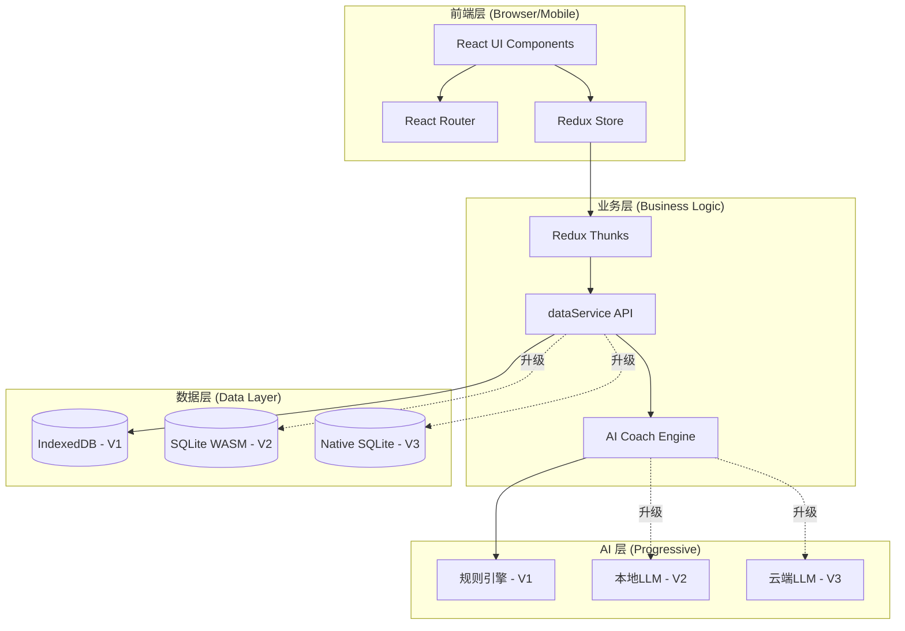
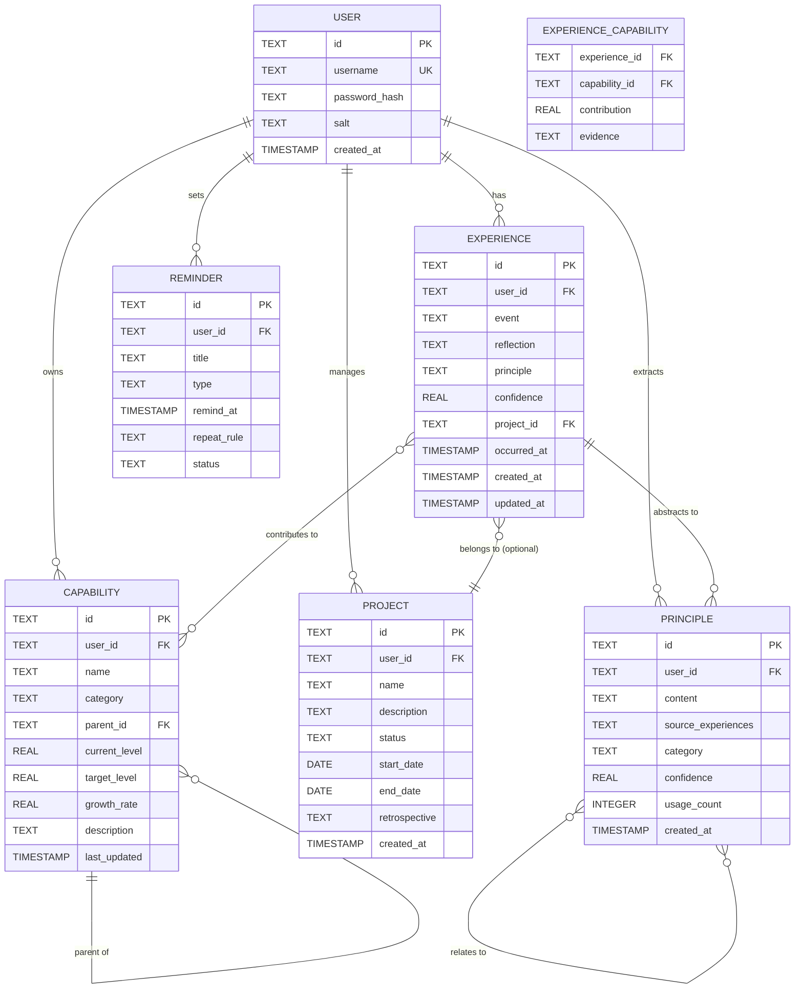

# GrowthOS 技术架构文档

## 0. 架构哲学

**核心原则**：本地优先（Local-First），隐私至上（Privacy-First），渐进式 AI（Progressive AI）

```
┌─────────────────────────────────────────────────────┐
│                  用户交互层                          │
│   React 18 + TypeScript + Vite                      │
│   - 移动端优先 UI                                    │
│   - 离线优先交互                                     │
└─────────────────────┬───────────────────────────────┘
                      │
┌─────────────────────▼───────────────────────────────┐
│                业务逻辑层                            │
│   Redux Toolkit + RTK Query (未来)                  │
│   - 经验/能力/项目状态管理                           │
│   - 成长画像计算                                     │
└─────────────────────┬───────────────────────────────┘
                      │
┌─────────────────────▼───────────────────────────────┐
│                 数据服务层                           │
│   dataService (适配器模式)                          │
│   - 业务API（createExperience / getCapabilities）   │
│   - 导出API（exportJSON / exportCSV）                │
└─────────────────────┬───────────────────────────────┘
                      │
┌─────────────────────▼───────────────────────────────┐
│              存储适配层（可替换）                     │
│   V1: IndexedDB (dexie.js)                          │
│   V2: SQLite WASM (wa-sqlite)                       │
│   V3: Native SQLite (Capacitor)                     │
└─────────────────────────────────────────────────────┘
```

---

## 1. 整体架构

### 1.1 分层架构


```mermaid
flowchart TB
    subgraph "前端层 (Browser/Mobile)"
        UI[React UI Components]
        Router[React Router]
        Store[Redux Store]
    end

    subgraph "业务层 (Business Logic)"
        Thunks[Redux Thunks]
        Services[dataService API]
        AI[AI Coach Engine]
    end

    subgraph "数据层 (Data Layer)"
        IndexedDB[(IndexedDB - V1)]
        SQLiteWASM[(SQLite WASM - V2)]
        NativeSQLite[(Native SQLite - V3)]
    end

    subgraph "AI 层 (Progressive)"
        RuleEngine[规则引擎 - V1]
        LocalLLM[本地LLM - V2]
        CloudLLM[云端LLM - V3]
    end

    UI --> Router
    UI --> Store
    Store --> Thunks
    Thunks --> Services
    Services --> IndexedDB
    Services -.升级.-> SQLiteWASM
    Services -.升级.-> NativeSQLite
    Services --> AI
    AI --> RuleEngine
    AI -.升级.-> LocalLLM
    AI -.升级.-> CloudLLM
```

### 1.2 核心设计决策

| 决策            | 方案                      | 理由                                |
| --------------- | ------------------------- | ----------------------------------- |
| **状态管理**    | Redux Toolkit             | 已成熟、调试工具完善                |
| **数据存储 V1** | IndexedDB (dexie.js)      | 浏览器原生，零依赖，5-10MB 数据轻松 |
| **数据存储 V2** | SQLite WASM (wa-sqlite)   | 真正的SQL，未来可平滑升级           |
| **数据存储 V3** | 原生 SQLite (Capacitor)   | 打包App时使用，.db文件可访问        |
| **加密**        | AES-GCM (Web Crypto API)  | 浏览器原生，安全等级高              |
| **AI V1**       | 规则引擎                  | 无依赖，立刻可用                    |
| **AI V2**       | 本地规则 + LLM API        | 用户可控                            |
| **离线优先**    | Service Worker + 本地数据 | 网络断开不影响使用                  |

---

## 2. 技术栈

### 2.1 前端

| 技术          | 版本 | 用途           |
| ------------- | ---- | -------------- |
| React         | 18   | UI 框架        |
| TypeScript    | 5.x  | 类型安全       |
| Vite          | 5.x  | 构建工具       |
| Redux Toolkit | 2.x  | 状态管理       |
| React Router  | 6.x  | 路由           |
| ReactFlow     | 12.x | 能力树可视化   |
| Recharts      | 3.x  | 成长曲线图表   |
| Tailwind CSS  | 3.x  | 样式           |
| i18next       | -    | 国际化         |
| dexie.js      | 4.x  | IndexedDB 封装 |
| zod           | 3.x  | 数据校验       |

### 2.2 数据存储演进

```
V1 (现在)
└── IndexedDB (dexie.js)
    - 数据库文件：浏览器沙盒内
    - 用户可导出：JSON / CSV
    - 容量：50% 磁盘配额（通常 1GB+）

V2 (3-6月)
└── SQLite WASM (wa-sqlite)
    - 真正的SQL引擎
    - 复杂查询性能好
    - 用户可导出：SQL / JSON / CSV

V3 (打包App)
└── 原生 SQLite (Capacitor + SQLCipher)
    - .db 文件用户可见
    - SQLCipher 加密
    - 支持系统级备份
```

### 2.3 AI 集成

| 阶段 | 方案               | 触发 | 数据流向 |
| ---- | ------------------ | ---- | -------- |
| V1   | 规则引擎           | 实时 | 本地     |
| V2   | LLM API (用户配置) | 异步 | 用户控制 |
| V3   | 本地 LLM (WebLLM)  | 异步 | 完全本地 |

---

## 3. 路由定义

### 3.1 路由表

| 路由                | 用途                           | 优先级 |
| ------------------- | ------------------------------ | ------ |
| `/`                 | 成长画像首页（"你正在成为谁"） | P0     |
| `/experiences`      | 经历列表 + 时间线              | P0     |
| `/experiences/new`  | 新建经历（结构化模板）         | P0     |
| `/experiences/:id`  | 经历详情                       | P0     |
| `/capabilities`     | 能力树管理                     | P0     |
| `/capabilities/:id` | 能力详情 + 贡献经历            | P0     |
| `/principles`       | 原则库                         | P1     |
| `/projects`         | 项目管理                       | P1     |
| `/projects/:id`     | 项目详情 + 复盘                | P1     |
| `/coach`            | AI 教练对话                    | P2     |
| `/analytics`        | 成长曲线 / 报告                | P1     |
| `/settings`         | 设置（数据导出/导入）          | P0     |
| `/auth/login`       | 登录                           | P0     |
| `/auth/register`    | 注册                           | P0     |

### 3.2 移动端路由

底部 Tab 栏（5 个核心入口）：

1. **首页** (`/`) — 成长画像
2. **经历** (`/experiences`) — 记录
3. **能力** (`/capabilities`) — 能力树
4. **项目** (`/projects`) — 项目管理
5. **我的** (`/settings`) — 设置

---

## 4. 数据模型（核心实体）

### 4.1 实体关系图


```mermaid
erDiagram
    USER ||--o{ EXPERIENCE : has
    USER ||--o{ CAPABILITY : owns
    USER ||--o{ PROJECT : manages
    USER ||--o{ PRINCIPLE : extracts
    USER ||--o{ REMINDER : sets

    EXPERIENCE }o--o{ CAPABILITY : "contributes to"
    EXPERIENCE }o--|| PROJECT : "belongs to (optional)"
    EXPERIENCE ||--o{ PRINCIPLE : "abstracts to"

    PRINCIPLE }o--o{ PRINCIPLE : "relates to"
    CAPABILITY ||--o{ CAPABILITY : "parent of"

    USER {
        TEXT id PK
        TEXT username UK
        TEXT password_hash
        TEXT salt
        TIMESTAMP created_at
    }

    EXPERIENCE {
        TEXT id PK
        TEXT user_id FK
        TEXT event
        TEXT reflection
        TEXT principle
        REAL confidence
        TEXT project_id FK
        TIMESTAMP occurred_at
        TIMESTAMP created_at
        TIMESTAMP updated_at
    }

    CAPABILITY {
        TEXT id PK
        TEXT user_id FK
        TEXT name
        TEXT category
        TEXT parent_id FK
        REAL current_level
        REAL target_level
        REAL growth_rate
        TEXT description
        TIMESTAMP last_updated
    }

    EXPERIENCE_CAPABILITY {
        TEXT experience_id FK
        TEXT capability_id FK
        REAL contribution
        TEXT evidence
    }

    PRINCIPLE {
        TEXT id PK
        TEXT user_id FK
        TEXT content
        TEXT source_experiences
        TEXT category
        REAL confidence
        INTEGER usage_count
        TIMESTAMP created_at
    }

    PROJECT {
        TEXT id PK
        TEXT user_id FK
        TEXT name
        TEXT description
        TEXT status
        DATE start_date
        DATE end_date
        TEXT retrospective
        TIMESTAMP created_at
    }

    REMINDER {
        TEXT id PK
        TEXT user_id FK
        TEXT title
        TEXT type
        TIMESTAMP remind_at
        TEXT repeat_rule
        TEXT status
    }
```

### 4.2 核心表 DDL

```sql
-- ============ 用户表 ============
CREATE TABLE users (
  id TEXT PRIMARY KEY,
  username TEXT UNIQUE NOT NULL,
  password_hash TEXT NOT NULL,
  salt TEXT NOT NULL,
  created_at TIMESTAMP DEFAULT CURRENT_TIMESTAMP,
  updated_at TIMESTAMP DEFAULT CURRENT_TIMESTAMP
);

-- ============ 经历表（核心）============
CREATE TABLE experiences (
  id TEXT PRIMARY KEY,
  user_id TEXT NOT NULL,
  event TEXT NOT NULL,                  -- 客观事件
  reflection TEXT,                      -- 主观反思
  principle TEXT,                       -- 抽象原则
  confidence REAL DEFAULT 0.5,          -- 确信度
  project_id TEXT,                      -- 关联项目
  mood INTEGER,                         -- 情绪 -10 ~ +10
  energy INTEGER,                       -- 能量 0-10
  occurred_at TIMESTAMP NOT NULL,       -- 事件发生时间
  created_at TIMESTAMP DEFAULT CURRENT_TIMESTAMP,
  updated_at TIMESTAMP DEFAULT CURRENT_TIMESTAMP,
  FOREIGN KEY (user_id) REFERENCES users(id) ON DELETE CASCADE,
  FOREIGN KEY (project_id) REFERENCES projects(id) ON DELETE SET NULL
);

CREATE INDEX idx_experiences_user_date ON experiences(user_id, occurred_at DESC);
CREATE INDEX idx_experiences_project ON experiences(project_id);

-- ============ 能力表（核心）============
CREATE TABLE capabilities (
  id TEXT PRIMARY KEY,
  user_id TEXT NOT NULL,
  name TEXT NOT NULL,
  category TEXT NOT NULL,               -- 思维/技能/认知/体能/社交
  parent_id TEXT,                       -- 父能力（支持树形）
  current_level REAL DEFAULT 0,         -- 当前水平 0-100
  target_level REAL DEFAULT 100,        -- 目标水平
  growth_rate REAL DEFAULT 0,           -- 增长率
  description TEXT,
  icon TEXT,
  color TEXT,
  last_updated TIMESTAMP DEFAULT CURRENT_TIMESTAMP,
  created_at TIMESTAMP DEFAULT CURRENT_TIMESTAMP,
  FOREIGN KEY (user_id) REFERENCES users(id) ON DELETE CASCADE,
  FOREIGN KEY (parent_id) REFERENCES capabilities(id) ON DELETE SET NULL
);

CREATE INDEX idx_capabilities_user ON capabilities(user_id);
CREATE INDEX idx_capabilities_parent ON capabilities(parent_id);

-- ============ 经历-能力关联表 ============
CREATE TABLE experience_capability_links (
  id TEXT PRIMARY KEY,
  experience_id TEXT NOT NULL,
  capability_id TEXT NOT NULL,
  contribution REAL DEFAULT 0.5,        -- 贡献度 0-1
  evidence TEXT,                        -- AI 提取的证据
  created_at TIMESTAMP DEFAULT CURRENT_TIMESTAMP,
  FOREIGN KEY (experience_id) REFERENCES experiences(id) ON DELETE CASCADE,
  FOREIGN KEY (capability_id) REFERENCES capabilities(id) ON DELETE CASCADE,
  UNIQUE(experience_id, capability_id)
);

CREATE INDEX idx_exp_cap_exp ON experience_capability_links(experience_id);
CREATE INDEX idx_exp_cap_cap ON experience_capability_links(capability_id);

-- ============ 原则表 ============
CREATE TABLE principles (
  id TEXT PRIMARY KEY,
  user_id TEXT NOT NULL,
  content TEXT NOT NULL,
  source_experiences TEXT,              -- JSON 数组
  category TEXT,
  confidence REAL DEFAULT 0.5,
  usage_count INTEGER DEFAULT 0,
  last_used_at TIMESTAMP,
  created_at TIMESTAMP DEFAULT CURRENT_TIMESTAMP,
  FOREIGN KEY (user_id) REFERENCES users(id) ON DELETE CASCADE
);

CREATE INDEX idx_principles_user ON principles(user_id);

-- ============ 项目表 ============
CREATE TABLE projects (
  id TEXT PRIMARY KEY,
  user_id TEXT NOT NULL,
  name TEXT NOT NULL,
  description TEXT,
  status TEXT DEFAULT 'active',         -- active/completed/paused/abandoned
  start_date DATE,
  end_date DATE,
  retrospective TEXT,                   -- JSON: {what_went_well, what_went_wrong, next_time}
  created_at TIMESTAMP DEFAULT CURRENT_TIMESTAMP,
  updated_at TIMESTAMP DEFAULT CURRENT_TIMESTAMP,
  FOREIGN KEY (user_id) REFERENCES users(id) ON DELETE CASCADE
);

CREATE INDEX idx_projects_user_status ON projects(user_id, status);

-- ============ 提醒表 ============
CREATE TABLE reminders (
  id TEXT PRIMARY KEY,
  user_id TEXT NOT NULL,
  title TEXT NOT NULL,
  type TEXT,                            -- review/goal/experience
  target_id TEXT,                       -- 关联目标
  remind_at TIMESTAMP NOT NULL,
  repeat_rule TEXT,                     -- JSON: {type, interval}
  status TEXT DEFAULT 'pending',        -- pending/done/snoozed
  created_at TIMESTAMP DEFAULT CURRENT_TIMESTAMP,
  FOREIGN KEY (user_id) REFERENCES users(id) ON DELETE CASCADE
);

CREATE INDEX idx_reminders_user_date ON reminders(user_id, remind_at);
```

### 4.3 能力水平历史表（成长曲线）

```sql
CREATE TABLE capability_history (
  id TEXT PRIMARY KEY,
  capability_id TEXT NOT NULL,
  level REAL NOT NULL,
  recorded_at TIMESTAMP DEFAULT CURRENT_TIMESTAMP,
  trigger_experience_id TEXT,
  FOREIGN KEY (capability_id) REFERENCES capabilities(id) ON DELETE CASCADE,
  FOREIGN KEY (trigger_experience_id) REFERENCES experiences(id) ON DELETE SET NULL
);

CREATE INDEX idx_cap_history_cap_date ON capability_history(capability_id, recorded_at);
```

### 4.4 兼容旧表（渐进迁移）

```sql
-- 保留旧的 records 表作为"原始素材"
-- 经历表与记录表是 1:0..1 关系
CREATE TABLE records (
  id TEXT PRIMARY KEY,
  user_id TEXT NOT NULL,
  title TEXT NOT NULL,
  content TEXT,
  category TEXT,
  tags TEXT,                            -- JSON 数组
  experience_id TEXT,                   -- 关联到 experience（可选）
  created_at TIMESTAMP DEFAULT CURRENT_TIMESTAMP,
  FOREIGN KEY (user_id) REFERENCES users(id) ON DELETE CASCADE,
  FOREIGN KEY (experience_id) REFERENCES experiences(id) ON DELETE SET NULL
);

-- 保留旧的 goals 表
CREATE TABLE goals (
  id TEXT PRIMARY KEY,
  user_id TEXT NOT NULL,
  title TEXT NOT NULL,
  description TEXT,
  target_date DATE,
  progress REAL DEFAULT 0,
  status TEXT DEFAULT 'active',
  related_capability_id TEXT,           -- 关联能力（V2 新增）
  created_at TIMESTAMP DEFAULT CURRENT_TIMESTAMP,
  FOREIGN KEY (user_id) REFERENCES users(id) ON DELETE CASCADE,
  FOREIGN KEY (related_capability_id) REFERENCES capabilities(id) ON DELETE SET NULL
);
```

---

## 5. 业务逻辑层

### 5.1 能力水平计算算法

```typescript
/**
 * 能力水平计算
 *
 * 输入：能力 + 关联的经历
 * 输出：当前能力水平 0-100
 */
function calculateCapabilityLevel(
  capability: Capability,
  experiences: Experience[],
  links: ExperienceCapabilityLink[],
): number {
  const relatedLinks = links.filter((l) => l.capabilityId === capability.id);

  let level = 0;

  for (const link of relatedLinks) {
    const exp = experiences.find((e) => e.id === link.experienceId);
    if (!exp) continue;

    // 基础贡献
    const baseContribution = link.contribution * 10;

    // 反思深度加成
    const reflectionBonus = exp.reflection ? 1.5 : 1.0;

    // 原则抽象加成
    const principleBonus = exp.principle ? 2.0 : 1.0;

    // 自信度加成
    const confidenceMultiplier = exp.confidence || 0.5;

    // 时间衰减（最近3个月权重更高）
    const daysAgo = (Date.now() - new Date(exp.occurredAt).getTime()) / (1000 * 60 * 60 * 24);
    const timeDecay = Math.exp(-daysAgo / 180); // 半年减半

    level += baseContribution * reflectionBonus * principleBonus * confidenceMultiplier * timeDecay;
  }

  return Math.min(100, Math.max(0, level));
}
```

### 5.2 成长画像生成

```typescript
interface GrowthPortrait {
  // 能力概览
  capabilities: {
    name: string;
    currentLevel: number;
    targetLevel: number;
    growthRate: number; // 本月增长率
    trend: 'up' | 'down' | 'stable';
  }[];

  // 核心洞察
  insights: {
    type: 'warning' | 'achievement' | 'suggestion';
    content: string;
    relatedCapabilityId?: string;
  }[];

  // 本月原则
  recentPrinciples: Principle[];

  // 推荐下一步
  recommendations: {
    type: 'review' | 'practice' | 'reflect';
    content: string;
    actionUrl: string;
  }[];
}
```

---

## 6. 数据导出 / 导入

### 6.1 导出格式

```typescript
// 完整 JSON 导出
interface ExportData {
  version: '2.0';
  exportedAt: string;
  app: 'GrowthOS';
  user: {
    username: string;
    // 不导出密码哈希
  };
  experiences: Experience[];
  capabilities: Capability[];
  principles: Principle[];
  projects: Project[];
  goals: Goal[];
  reminders: Reminder[];
  capabilityHistory: CapabilityHistory[];
}

// CSV 导出（按表）
async function exportCSV(table: 'experiences' | 'capabilities' | ...): Promise<Blob>
```

### 6.2 导入逻辑

```typescript
async function importData(file: File): Promise<ImportResult> {
  // 1. 解析 JSON
  const data = JSON.parse(await file.text());

  // 2. 校验格式（zod schema）
  const validated = ExportSchema.parse(data);

  // 3. 用户确认（合并/覆盖/跳过）
  // 4. 写入数据
  // 5. 返回结果
}
```

---

## 7. 安全设计

### 7.1 密码存储

```typescript
// 注册时
const salt = crypto.getRandomValues(new Uint8Array(16));
const saltHex = bytesToHex(salt);
const passwordHash = await sha256(password + saltHex);

// 存储
{
  username: 'user',
  password_hash: 'abc123...',
  salt: 'def456...'
}
```

### 7.2 数据加密

V1 阶段：敏感字段（密码哈希、原则内容）使用 AES-GCM 加密存储。
V2 阶段：全数据库加密（SQLCipher）。

### 7.3 导入导出安全

- 导入时使用 zod schema 严格校验
- 拒绝未知字段
- 限制文件大小（< 10MB）

---

## 8. 部署架构

### 8.1 V1：浏览器 / PWA

```
用户设备
├── 浏览器 (Chrome/Safari/Firefox)
│   ├── 静态资源 (HTML/CSS/JS) — 从 Vercel/Netlify 加载
│   ├── Service Worker — 离线缓存
│   └── IndexedDB — 本地数据
```

**托管方式**：

- 静态资源：Vercel / Netlify / GitHub Pages
- 数据：完全本地，无后端
- 离线：Service Worker 缓存核心资源

### 8.2 V2：打包移动 App（Capacitor）

```
iOS / Android
├── WebView (应用内浏览器)
│   ├── React App
│   └── 原生 SQLite 适配
└── 原生层
    ├── SQLite.framework (iOS) / SQLite JDBC (Android)
    ├── Filesystem API
    ├── Share API
    └── SQLCipher 加密
```

**构建命令**：

```bash
npm run build
npx cap sync
npx cap open ios      # iOS
npx cap open android  # Android
```

---

## 9. 性能指标

| 指标                   | 目标    | 当前  |
| ---------------------- | ------- | ----- |
| 首屏加载               | < 2s    | 1.5s  |
| 经历列表渲染（1000条） | < 200ms | 待测  |
| 能力树渲染（100节点）  | < 300ms | 待测  |
| 导出 5000 条数据       | < 3s    | 待测  |
| Bundle 体积（gzipped） | < 500KB | 349KB |

---

## 10. 演进路线

```
V1 (现在)
├── 数据模型：experiences / capabilities / principles
├── 能力树 CRUD
├── 经历记录（结构化模板）
├── 基础首页：能力雷达图
└── 数据导出：JSON / CSV

V2 (1-2月)
├── 成长曲线（能力随时间变化）
├── 经验网络可视化
├── 项目复盘
└── 规则引擎报告

V3 (3-4月)
├── LLM 集成（可选）
├── AI 主动诊断
└── 经验迁移推荐

V4 (5-6月)
├── Capacitor 打包
├── 原生 SQLite
├── SQLCipher 加密
└── 跨设备同步（可选）
```

---

_文档版本：v2.0 - 经验管理系统架构_
_更新时间：2024_
