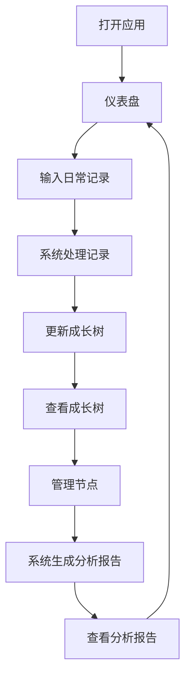
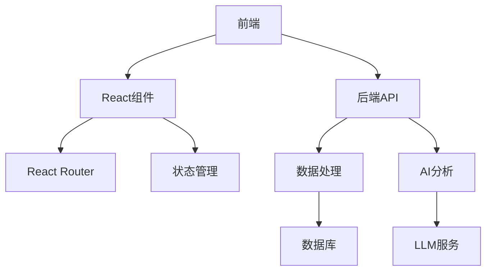
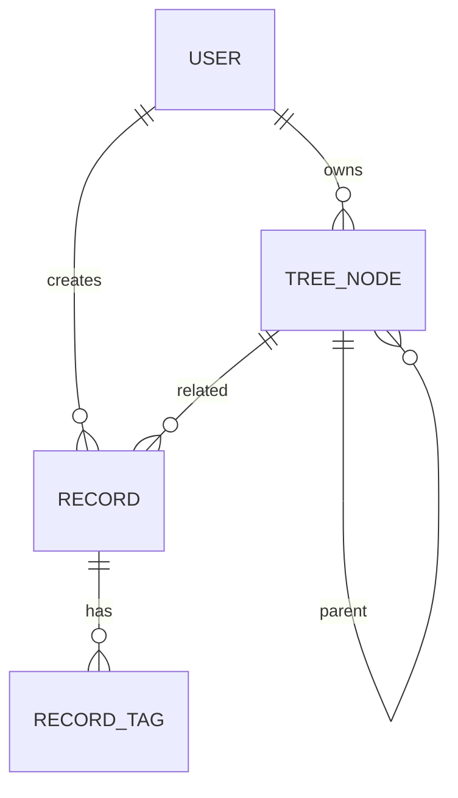

# GrowthOS UI设计文档

## 1. 产品概述
GrowthOS是一个通过「成长树 + 行为数据 + AI分析」来结构化还原一个人完整成长轨迹的系统。
- 解决用户记录但不理解、连接知识但不关心成长、有数据但没有结构、有情绪但无法长期分析的问题
- 目标是把"一个人"变成一个可被理解、可被分析、可被进化的系统

## 2. 核心功能

### 2.1 用户角色
| 角色 | 注册方式 | 核心权限 |
|------|---------------------|------------------|
| 普通用户 | 邮箱注册 | 记录日常活动、管理成长树、查看分析报告 |

### 2.2 功能模块
1. **仪表盘**：成长树预览、日常记录输入、快速统计
2. **成长树**：树结构管理、节点详情、AI园丁模式
3. **分析**：数据统计、AI分析（三层级功能）

### 2.3 页面详情
| 页面名称 | 模块名称 | 功能描述 |
|-----------|-------------|---------------------|
| 仪表盘 | 成长树预览 | 显示成长树的概览，包括最近添加的节点 |
| 仪表盘 | 日常记录 | 输入每日活动、学习内容、情绪状态和反思 |
| 仪表盘 | 快速统计 | 显示本周打卡次数、专注时长和情绪平均值 |
| 成长树 | 树管理 | 可视化管理成长树结构，支持添加、编辑、删除节点 |
| 成长树 | 节点详情 | 查看和更新节点属性（掌握度、状态、时间线） |
| 成长树 | AI园丁模式 | 智能归类建议、子分类建议和语义聚类 |
| 分析 | 数据统计 | 显示基本数据统计，如本周打卡、专注时长、情绪平均值 |
| 分析 | AI分析-层级一 | 数据清洗与结构化，包括自动标签化、情绪打分、关联节点 |
| 分析 | AI分析-层级二 | 洞察与发现，包括归因分析、隐性模式识别、性格/价值观动态画像 |
| 分析 | AI分析-层级三 | 行动建议，包括动态策略调整、成长树养护建议 |
| 分析 | 成长报告 | 生成周期性的成长报告，总结用户的成长情况 |

## 3. 核心流程
用户日常使用流程：
1. 用户打开应用，进入仪表盘
2. 输入今日活动、学习内容、情绪状态和反思
3. 系统自动处理记录，更新成长树
4. 用户查看成长树，管理节点
5. 系统定期生成分析报告，提供洞察和建议



## 4. 用户界面设计
### 4.1 设计风格
- **主色调**：绿色 (#4CAF50)，代表成长和生机
- **辅助色**：蓝色 (#2196F3)、黄色 (#FFC107)、紫色 (#9C27B0)
- **按钮风格**：圆角按钮，有轻微的阴影和悬停效果
- **字体**：
  - 标题：Plus Jakarta Sans，粗体
  - 正文：Inter，常规
- **布局风格**：卡片式布局，顶部导航
- **图标/表情风格**：使用简洁的线性图标和相关的表情符号
- **动画效果**：流畅的过渡动画，如树抖动、经验值增长动画

### 4.2 页面设计概览
| 页面名称 | 模块名称 | UI元素 |
|-----------|-------------|-------------|
| 仪表盘 | 成长树预览 | 卡片式布局，显示成长树的简化视图，使用不同颜色区分四大主干，添加轻微的动画效果 |
| 仪表盘 | 日常记录 | 表单布局，包含输入框、下拉选择和文本域，支持#标签输入，提交按钮有悬停效果 |
| 仪表盘 | 快速统计 | 网格布局，显示三个统计卡片，使用大号字体显示数值，小号字体显示标签 |
| 成长树 | 树管理 | 大型可视化区域，显示完整的成长树结构，支持拖拽调整，节点有不同的状态样式 |
| 成长树 | 节点详情 | 表单布局，显示节点的详细属性，包括名称、掌握度、状态和时间线 |
| 成长树 | AI园丁模式 | 卡片式布局，显示智能归类建议和子分类建议，使用不同颜色区分不同类型的建议 |
| 分析 | 数据统计 | 网格布局，显示多个统计卡片，使用图表可视化数据 |
| 分析 | AI分析 | 卡片式布局，显示不同层级的AI分析结果，使用图标和颜色区分不同类型的分析 |
| 分析 | 成长报告 | 卡片式布局，显示周期性的成长报告，使用图表和文字结合的方式呈现 |

### 4.3 响应式设计
- **设计理念**：桌面优先，移动端自适应
- **断点设置**：
  - 大屏 (≥ 1200px)：三列布局
  - 中屏 (768px - 1199px)：两列布局
  - 小屏 (≤ 767px)：单列布局
- **触控优化**：增大移动端的点击区域，优化触控体验
- **导航**：在移动端使用汉堡菜单替代水平导航

### 4.4 3D场景指导（可选）
- **环境**：柔和的自然光线，微妙的背景
- **光照**：温暖的环境光，活动节点的定向高光
- **相机**：树探索的轨道控制
- **构图**：居中的树，留有扩展空间
- **交互**：悬停效果，点击展开节点
- **后处理**：微妙的景深，聚焦于选定节点

## 5. 技术架构

### 5.1 架构设计


### 5.2 技术描述
- **前端**：React@18 + Tailwind CSS@3 + Vite
- **初始化工具**：Vite
- **后端**：Express@4
- **数据库**：PostgreSQL
- **AI服务**：OpenAI API / Qwen-Turbo

### 5.3 路由定义
| 路由 | 用途 |
|-------|---------|
| / | 仪表盘页面 |
| /growth-tree | 成长树管理页面 |
| /analytics | 分析页面 |
| /auth | 认证页面 |

### 5.4 API定义
| API路径 | 方法 | 功能 | 请求体 | 响应 |
|---------|------|------|---------|--------|
| /api/records | POST | 创建记录 | {activity, learning, mood, reflection, tags} | {id, success} |
| /api/records | GET | 获取记录 | N/A | [{id, activity, learning, mood, reflection, tags, createdAt}] |
| /api/tree | GET | 获取成长树 | N/A | {id, name, children, progress} |
| /api/tree/node | POST | 创建节点 | {name, parentId, type} | {id, success} |
| /api/tree/node/:id | PUT | 更新节点 | {name, progress, status} | {success} |
| /api/tree/node/:id | DELETE | 删除节点 | N/A | {success} |
| /api/analytics | GET | 获取分析 | N/A | {stats, insights, suggestions} |

### 5.5 数据模型
#### 5.5.1 数据模型定义


#### 5.5.2 数据定义语言
```sql
-- 用户表
CREATE TABLE users (
  id SERIAL PRIMARY KEY,
  name VARCHAR(255) NOT NULL,
  email VARCHAR(255) UNIQUE NOT NULL,
  password_hash VARCHAR(255) NOT NULL,
  created_at TIMESTAMP DEFAULT CURRENT_TIMESTAMP
);

-- 记录表
CREATE TABLE records (
  id SERIAL PRIMARY KEY,
  user_id INTEGER REFERENCES users(id),
  activity TEXT,
  learning TEXT,
  mood INTEGER,
  reflection TEXT,
  created_at TIMESTAMP DEFAULT CURRENT_TIMESTAMP
);

-- 记录标签表
CREATE TABLE record_tags (
  id SERIAL PRIMARY KEY,
  record_id INTEGER REFERENCES records(id),
  tag VARCHAR(255) NOT NULL
);

-- 树节点表
CREATE TABLE tree_nodes (
  id SERIAL PRIMARY KEY,
  user_id INTEGER REFERENCES users(id),
  parent_id INTEGER REFERENCES tree_nodes(id),
  name VARCHAR(255) NOT NULL,
  type VARCHAR(50),
  progress INTEGER DEFAULT 0,
  status VARCHAR(50) DEFAULT '未开始',
  created_at TIMESTAMP DEFAULT CURRENT_TIMESTAMP,
  updated_at TIMESTAMP DEFAULT CURRENT_TIMESTAMP
);

-- 节点关联记录表
CREATE TABLE node_records (
  id SERIAL PRIMARY KEY,
  node_id INTEGER REFERENCES tree_nodes(id),
  record_id INTEGER REFERENCES records(id)
);
```