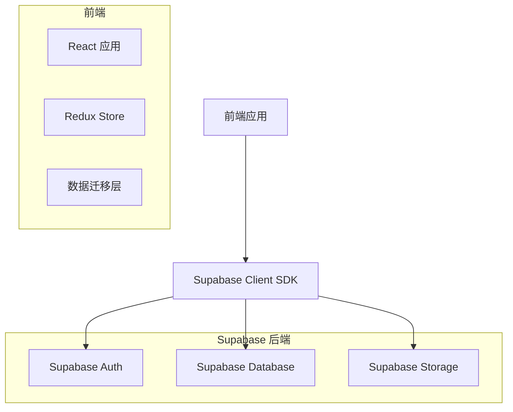

# Supabase 后端开发设计文档

## 1. 项目概述

### 1.1 项目背景
GrowthOS 是一个个人成长追踪系统，当前采用纯前端实现，所有数据存储在浏览器 LocalStorage 中。为了实现数据持久化、多设备同步和用户认证，需要添加后端服务。

### 1.2 目标
- 实现用户认证系统
- 数据持久化到云端
- 支持多设备同步
- 提供完整的 CRUD 操作
- 从 LocalStorage 迁移现有数据

## 2. 技术架构

### 2.1 技术栈
- **前端**：React 18 + TypeScript + Vite
- **后端**：Supabase Cloud
- **数据库**：PostgreSQL (Supabase)
- **认证**：Supabase Auth
- **存储**：Supabase Storage

### 2.2 系统架构



## 3. 数据库设计

### 3.1 表结构

#### 3.1.1 users 表
| 字段名 | 数据类型 | 约束 | 描述 |
|--------|---------|------|------|
| id | UUID | PRIMARY KEY | 用户ID |
| email | TEXT | UNIQUE NOT NULL | 邮箱 |
| password | TEXT | NOT NULL | 密码（加密） |
| name | TEXT | | 用户名 |
| created_at | TIMESTAMP | DEFAULT NOW() | 创建时间 |

#### 3.1.2 growth_trees 表
| 字段名 | 数据类型 | 约束 | 描述 |
|--------|---------|------|------|
| id | UUID | PRIMARY KEY | 成长树ID |
| user_id | UUID | REFERENCES users(id) | 用户ID |
| name | TEXT | NOT NULL | 成长树名称 |
| created_at | TIMESTAMP | DEFAULT NOW() | 创建时间 |

#### 3.1.3 tree_nodes 表
| 字段名 | 数据类型 | 约束 | 描述 |
|--------|---------|------|------|
| id | UUID | PRIMARY KEY | 节点ID |
| tree_id | UUID | REFERENCES growth_trees(id) | 成长树ID |
| parent_id | UUID | REFERENCES tree_nodes(id) | 父节点ID |
| name | TEXT | NOT NULL | 节点名称 |
| type | TEXT | NOT NULL | 节点类型 |
| mastery | INTEGER | DEFAULT 0 | 掌握程度 |
| status | TEXT | DEFAULT 'not_started' | 状态 |
| start_date | TIMESTAMP | | 开始日期 |
| last_updated | TIMESTAMP | DEFAULT NOW() | 最后更新时间 |

#### 3.1.4 daily_records 表
| 字段名 | 数据类型 | 约束 | 描述 |
|--------|---------|------|------|
| id | UUID | PRIMARY KEY | 记录ID |
| user_id | UUID | REFERENCES users(id) | 用户ID |
| date | DATE | NOT NULL | 记录日期 |
| mood | TEXT | | 情绪状态 |
| reflection | TEXT | | 反思 |
| created_at | TIMESTAMP | DEFAULT NOW() | 创建时间 |

#### 3.1.5 record_items 表
| 字段名 | 数据类型 | 约束 | 描述 |
|--------|---------|------|------|
| id | UUID | PRIMARY KEY | 记录项目ID |
| record_id | UUID | REFERENCES daily_records(id) | 记录ID |
| type | TEXT | NOT NULL | 项目类型 |
| content | TEXT | NOT NULL | 项目内容 |

#### 3.1.6 goals 表
| 字段名 | 数据类型 | 约束 | 描述 |
|--------|---------|------|------|
| id | UUID | PRIMARY KEY | 目标ID |
| user_id | UUID | REFERENCES users(id) | 用户ID |
| title | TEXT | NOT NULL | 目标标题 |
| description | TEXT | | 目标描述 |
| target_value | INTEGER | NOT NULL | 目标值 |
| current_value | INTEGER | DEFAULT 0 | 当前值 |
| start_date | DATE | NOT NULL | 开始日期 |
| end_date | DATE | NOT NULL | 结束日期 |
| status | TEXT | DEFAULT 'active' | 状态 |
| created_at | TIMESTAMP | DEFAULT NOW() | 创建时间 |
| updated_at | TIMESTAMP | DEFAULT NOW() | 更新时间 |

#### 3.1.7 reminders 表
| 字段名 | 数据类型 | 约束 | 描述 |
|--------|---------|------|------|
| id | UUID | PRIMARY KEY | 提醒ID |
| user_id | UUID | REFERENCES users(id) | 用户ID |
| title | TEXT | NOT NULL | 提醒标题 |
| description | TEXT | | 提醒描述 |
| date | DATE | NOT NULL | 提醒日期 |
| time | TIME | NOT NULL | 提醒时间 |
| is_completed | BOOLEAN | DEFAULT false | 是否完成 |
| created_at | TIMESTAMP | DEFAULT NOW() | 创建时间 |
| updated_at | TIMESTAMP | DEFAULT NOW() | 更新时间 |

### 3.2 RLS 策略

```sql
-- 启用 RLS
ALTER TABLE users ENABLE ROW LEVEL SECURITY;
ALTER TABLE growth_trees ENABLE ROW LEVEL SECURITY;
ALTER TABLE tree_nodes ENABLE ROW LEVEL SECURITY;
ALTER TABLE daily_records ENABLE ROW LEVEL SECURITY;
ALTER TABLE record_items ENABLE ROW LEVEL SECURITY;
ALTER TABLE goals ENABLE ROW LEVEL SECURITY;
ALTER TABLE reminders ENABLE ROW LEVEL SECURITY;

-- 用户表策略
CREATE POLICY "Users can view own profile" ON users
  FOR SELECT USING (auth.uid() = id);

-- 成长树表策略
CREATE POLICY "Users can manage own growth trees" ON growth_trees
  FOR ALL USING (auth.uid() = user_id);

-- 树节点表策略
CREATE POLICY "Users can manage own tree nodes" ON tree_nodes
  FOR ALL USING (
    EXISTS (
      SELECT 1 FROM growth_trees 
      WHERE growth_trees.id = tree_nodes.tree_id 
      AND growth_trees.user_id = auth.uid()
    )
  );

-- 日常记录表策略
CREATE POLICY "Users can manage own records" ON daily_records
  FOR ALL USING (auth.uid() = user_id);

-- 记录项目表策略
CREATE POLICY "Users can manage own record items" ON record_items
  FOR ALL USING (
    EXISTS (
      SELECT 1 FROM daily_records 
      WHERE daily_records.id = record_items.record_id 
      AND daily_records.user_id = auth.uid()
    )
  );

-- 目标表策略
CREATE POLICY "Users can manage own goals" ON goals
  FOR ALL USING (auth.uid() = user_id);

-- 提醒表策略
CREATE POLICY "Users can manage own reminders" ON reminders
  FOR ALL USING (auth.uid() = user_id);
```

## 4. API 设计

### 4.1 认证 API

| 方法 | 功能 | 接口 |
|------|------|------|
| POST | 注册 | `supabase.auth.signUp()` |
| POST | 登录 | `supabase.auth.signInWithPassword()` |
| POST | 登出 | `supabase.auth.signOut()` |
| GET | 获取当前用户 | `supabase.auth.getUser()` |

### 4.2 数据 API

#### 4.2.1 成长树 API

| 方法 | 功能 | 接口 |
|------|------|------|
| GET | 获取用户的成长树 | `supabase.from('growth_trees').select()` |
| POST | 创建成长树 | `supabase.from('growth_trees').insert()` |
| PUT | 更新成长树 | `supabase.from('growth_trees').update()` |
| DELETE | 删除成长树 | `supabase.from('growth_trees').delete()` |

#### 4.2.2 树节点 API

| 方法 | 功能 | 接口 |
|------|------|------|
| GET | 获取树节点 | `supabase.from('tree_nodes').select()` |
| POST | 创建树节点 | `supabase.from('tree_nodes').insert()` |
| PUT | 更新树节点 | `supabase.from('tree_nodes').update()` |
| DELETE | 删除树节点 | `supabase.from('tree_nodes').delete()` |

#### 4.2.3 日常记录 API

| 方法 | 功能 | 接口 |
|------|------|------|
| GET | 获取日常记录 | `supabase.from('daily_records').select()` |
| POST | 创建日常记录 | `supabase.from('daily_records').insert()` |
| PUT | 更新日常记录 | `supabase.from('daily_records').update()` |
| DELETE | 删除日常记录 | `supabase.from('daily_records').delete()` |

#### 4.2.4 目标 API

| 方法 | 功能 | 接口 |
|------|------|------|
| GET | 获取目标 | `supabase.from('goals').select()` |
| POST | 创建目标 | `supabase.from('goals').insert()` |
| PUT | 更新目标 | `supabase.from('goals').update()` |
| DELETE | 删除目标 | `supabase.from('goals').delete()` |

#### 4.2.5 提醒 API

| 方法 | 功能 | 接口 |
|------|------|------|
| GET | 获取提醒 | `supabase.from('reminders').select()` |
| POST | 创建提醒 | `supabase.from('reminders').insert()` |
| PUT | 更新提醒 | `supabase.from('reminders').update()` |
| DELETE | 删除提醒 | `supabase.from('reminders').delete()` |

## 5. 实现步骤

### 5.1 环境准备

1. **创建 Supabase 项目**
   - 访问 [Supabase Dashboard](https://app.supabase.com/)
   - 创建新的 Supabase 项目
   - 记录项目 URL 和 API 密钥

2. **配置环境变量**
   - 创建 `.env` 文件
   - 添加 Supabase 项目配置

3. **安装依赖**
   - 安装 Supabase Client SDK

### 5.2 数据库初始化

1. **执行 SQL 脚本**
   - 在 Supabase Dashboard 的 SQL Editor 中执行数据库初始化脚本

2. **配置 RLS 策略**
   - 执行 RLS 策略配置脚本

### 5.3 前端集成

1. **配置 Supabase 客户端**
   - 创建 Supabase 客户端实例
   - 配置认证状态监听

2. **实现认证流程**
   - 注册页面
   - 登录页面
   - 登出功能

3. **实现数据服务**
   - 创建数据服务层
   - 实现 CRUD 操作

### 5.4 数据迁移

1. **迁移逻辑**
   - 检测本地数据
   - 映射到 Supabase 表结构
   - 批量插入数据

2. **迁移流程**
   - 用户登录/注册
   - 触发数据迁移
   - 验证迁移结果
   - 清理本地数据

### 5.5 功能实现

1. **成长树管理**
   - 树的创建、编辑、删除
   - 节点的管理

2. **记录管理**
   - 日常记录的创建、编辑、删除
   - 记录项目的管理

3. **目标管理**
   - 目标的创建、编辑、删除
   - 目标进度更新

4. **提醒管理**
   - 提醒的创建、编辑、删除
   - 提醒状态更新

### 5.6 测试验证

1. **认证测试**
   - 注册流程
   - 登录流程
   - 登出流程

2. **数据测试**
   - 数据创建
   - 数据读取
   - 数据更新
   - 数据删除

3. **迁移测试**
   - 本地数据检测
   - 数据映射
   - 批量插入
   - 数据验证

4. **边界测试**
   - 网络错误处理
   - 认证失败处理
   - 数据冲突处理

## 6. 数据迁移策略

### 6.1 迁移流程

1. **检测本地数据**
   - 检查 LocalStorage 中是否存在数据
   - 读取数据结构

2. **数据映射**
   - 将本地数据映射到 Supabase 表结构
   - 处理数据格式转换

3. **批量插入**
   - 按表结构批量插入数据
   - 处理外键关系

4. **验证迁移**
   - 验证数据完整性
   - 检查数据一致性

5. **清理本地数据**
   - 可选：清理 LocalStorage 数据
   - 标记迁移完成

### 6.2 迁移脚本

```javascript
// 数据迁移脚本
async function migrateData(supabase) {
  try {
    // 1. 检测本地数据
    const localData = {
      records: secureStorage.getItem('growthos-records') || [],
      tree: secureStorage.getItem('growthos-tree') || null,
      goals: secureStorage.getItem('growthos-goals') || [],
      reminders: secureStorage.getItem('growthos-reminders') || []
    };

    // 2. 映射数据并插入
    await Promise.all([
      migrateRecords(supabase, localData.records),
      migrateGrowthTree(supabase, localData.tree),
      migrateGoals(supabase, localData.goals),
      migrateReminders(supabase, localData.reminders)
    ]);

    // 3. 标记迁移完成
    secureStorage.setItem('growthos-migrated', true);
    return true;
  } catch (error) {
    console.error('数据迁移失败:', error);
    return false;
  }
}
```

## 7. 测试计划

### 7.1 单元测试

- **认证测试**
  - 注册功能
  - 登录功能
  - 登出功能

- **数据服务测试**
  - 数据创建
  - 数据读取
  - 数据更新
  - 数据删除

- **迁移测试**
  - 本地数据检测
  - 数据映射
  - 批量插入
  - 数据验证

### 7.2 集成测试

- **认证流程测试**
  - 完整注册登录流程
  - 认证状态管理

- **数据流程测试**
  - 完整 CRUD 流程
  - 数据关联处理

- **迁移流程测试**
  - 完整迁移流程
  - 迁移失败处理

### 7.3 端到端测试

- **用户场景测试**
  - 注册 -> 登录 -> 创建记录
  - 登录 -> 查看成长树 -> 编辑节点
  - 登录 -> 创建目标 -> 更新进度

- **边界测试**
  - 网络错误处理
  - 认证失败处理
  - 数据冲突处理

## 8. 部署计划

### 8.1 部署步骤

1. **前端构建**
   - 运行 `npm run build`
   - 生成生产构建

2. **环境配置**
   - 配置生产环境变量
   - 部署到静态托管服务

3. **监控配置**
   - 配置 Supabase 监控
   - 配置错误跟踪

### 8.2 部署环境

- **前端**：Vercel / Netlify / GitHub Pages
- **后端**：Supabase Cloud
- **数据库**：Supabase PostgreSQL

## 9. 风险评估

### 9.1 潜在风险

- **数据迁移失败**：本地数据格式与 Supabase 表结构不匹配
- **认证问题**：用户忘记密码或邮箱
- **网络问题**：网络不稳定导致数据同步失败
- **数据冲突**：多设备同时编辑导致数据冲突

### 9.2 风险缓解

- **数据备份**：迁移前备份本地数据
- **错误处理**：完善错误处理和用户提示
- **重试机制**：实现网络错误自动重试
- **乐观更新**：实现乐观更新减少用户等待

## 10. 后续规划

### 10.1 功能扩展

- **实时同步**：实现实时数据同步
- **推送通知**：实现提醒推送功能
- **数据分析**：添加数据分析和可视化
- **API 集成**：集成第三方 API

### 10.2 性能优化

- **数据缓存**：实现客户端数据缓存
- **批量操作**：优化批量数据操作
- **索引优化**：优化数据库索引
- **查询优化**：优化 SQL 查询

### 10.3 安全增强

- **数据加密**：增强数据加密
- **权限管理**：细化权限控制
- **审计日志**：添加操作审计日志
- **安全扫描**：定期安全扫描

---

## 11. 总结

本设计文档详细规划了 GrowthOS 项目的后端开发，包括：

- **技术选型**：Supabase Cloud 作为后端服务
- **数据库设计**：完整的表结构和 RLS 策略
- **API 设计**：全面的 CRUD 操作
- **实现步骤**：从环境准备到功能实现
- **数据迁移**：从 LocalStorage 到 Supabase 的完整迁移
- **测试计划**：全面的测试策略

通过本设计，GrowthOS 将实现从纯前端应用到全栈应用的转变，为用户提供更可靠、更强大的个人成长追踪系统。